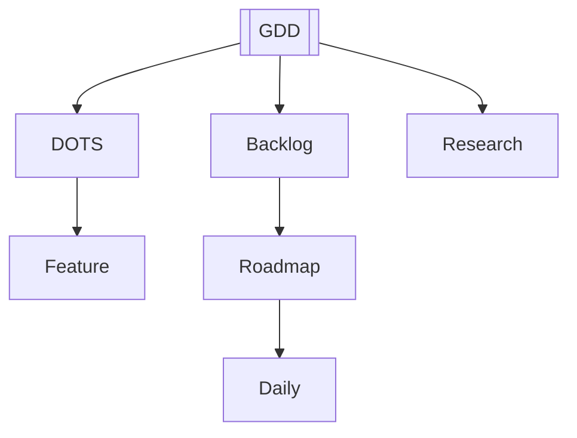

# MOC — VR Mines (Training Simulator)

## Key Hubs
- [[../70_Project_Documentation/GDD/VR_Mines_GDD|GDD — VR Mines: SafeOps]]
- [[../70_Project_Documentation/VR_Coal_Mining_Simulator/Backlog|Backlog]]
- [[../70_Project_Documentation/DOTS_Migration_Plan|DOTS Migration Plan]]
- [[../70_Project_Documentation/VR_Coal_Mining_Simulator/Features/Drill_System_DOTS|Feature: Drill System (DOTS)]]
- [[../70_Project_Documentation/VR_Coal_Mining_Simulator/Meetings/2025-09-11_Minutes|Meeting Minutes 2025-09-11]]
- [[../80_Research_Notes/Coal_Mining_Workflow_and_Machines|Research: Workflow & Machines]]
- [[../80_Research_Notes/VR_Immersion_Factors_Training_Simulations|Research: VR Immersion Factors]]
- [[../90_Roadmap_Updates/90_Day_Roadmap_Update_Week1|Roadmap Update — Week 1]]
- [[../40_Daily/README|Daily Logs]]

## Project Graph

## Current Focus
- Quest 3 performance → ECS conversion for drill, carts, scoring

## Quick Filters (use in Obsidian Graph)
- Tag filter: `#project/vr-mines`
- Path filter: `70_Project_Documentation/VR_Coal_Mining_Simulator/`
