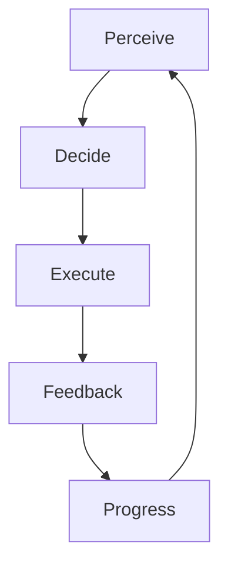

# Gameplay Specification

Links: [[../../80_Research_Notes/Game_Design_Fundamentals_Bible|Game Design Fundamentals — Bible]], [[./Mechanics_Spec|Mechanics Spec]], [[./User_Journey_Flow|User Journey Flow]], [[./Design_Experience_Guidelines|Design Experience Guidelines]], [[./INDEX|Simulator Index]]

## Purpose
Define how the simulator plays from moment to moment: objectives, core loop, turn/phase structure, win/fail conditions, pacing, and content envelopes.

## Objective
- Primary: complete assigned mining operations safely and efficiently while learning key procedures.
- Secondary: maintain safety score, minimize hazards, and achieve scenario-specific KPIs.

## Core Loop
1) Perceive environment and goals → 2) Decide action(s) using tools/equipment → 3) Execute with XR inputs → 4) Receive feedback (score, hazards, narration) → 5) Advance scenario state.

## Phases (Scenario)
- Briefing → Preparation → Operation → Debrief.

### Briefing
- Objectives, environment overview, PPE check, tool tutorial.

### Preparation
- Path planning, hazard review, equipment readiness checks.

### Operation (Moment-to-Moment)
- Navigate → Inspect → Drill/Handle equipment → Manage hazards → Communicate.

### Debrief
- Present metrics: safety compliance, time, resource usage, incidents; reflective prompts.

## Turn/Timing Model
- Real-time with micro-windows for critical decisions; optional timers for AP mitigation in training modules.

## Scoring & Progression
- Points from tasks done safely, penalties for violations, bonuses for proactive hazard mitigation.
- Transparent conversion and periodic summaries per the Bible’s clarity rules.

## Difficulty & Flow
- Dynamic assist: hints, slower hazards early; unlock advanced rules gradually.

## Content Envelopes
- Scenario tags: learning-goal, hazard-type, equipment, complexity tier.

## Conflict & Resolution
- Deterministic priority where possible; random elements only for uncertainty; tie-breakers via momentum-style deterministic checks when applicable.

## Accessibility
- Subtitles, color-blind palette, large interactables, reduced dexterity modes.

Backlinks: [[./INDEX|Simulator Index]]

