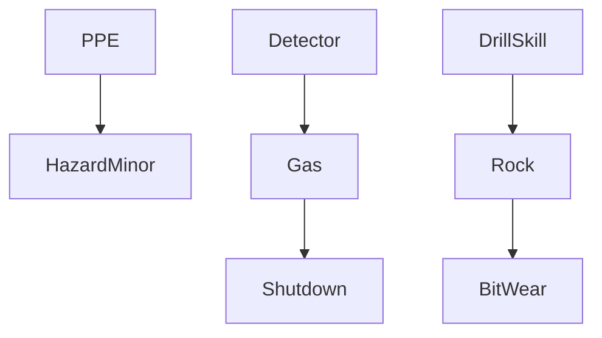

# Mechanics Specification

Links: [[../../80_Research_Notes/Game_Design_Fundamentals_Bible|Game Design Fundamentals — Bible]], [[./Gameplay_Spec|Gameplay Spec]], [[./User_Journey_Flow|User Journey Flow]]

## Components
- Player avatar, PPE items, tools (drill, detectors), environment zones (safe, hazard, friction), resources (time/energy), score trackers.

## Core Verbs
- Move, Inspect, Equip, Drill, Report, Place/Remove obstacle, Communicate, Acknowledge prompts.

## Systems
### 1. Hazard Manager
- Spawns hazards per scenario; exposes detection cues; supports mitigation actions.

### 2. Equipment System
- State: ready, degraded, unsafe; maintenance checks gate operation.

### 3. Resource Economy
- Time and energy as primary currencies; sinks through actions; regeneration via safe stations.

### 4. Rule-Change Events
- Temporary modifiers to movement, tool efficiency, or detection noise.

## Information Model
- Public: environment markers, timers, team status.
- Private: inspection results until shared.

## Conflict Resolution
- Priority → modifiers → randomness; deterministic tie-breakers when values equal (e.g., momentum analogue).

## Balancing Hooks
- Tunables: hazard frequency, detection accuracy, action costs, penalty scales, bonus thresholds.

## Tags for Content
- hazard-type, equipment, learning-goal, complexity-tier, interaction-level.

## Example RPS+ Graph

Backlinks: [[./INDEX|Simulator Index]]

