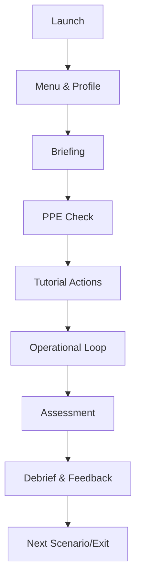

# User Journey Flow

Links: [[../../80_Research_Notes/Game_Design_Fundamentals_Bible|Game Design Fundamentals — Bible]], [[./Gameplay_Spec|Gameplay Spec]], [[./Design_Experience_Guidelines|Design Experience Guidelines]]

## Narrative Outline
- Entry → Orientation → Tutorialized First Task → Free Play with Guardrails → Assessment → Debrief → Next Scenario.

## High-Level Flow

## Teaching Sequence
1. State objective and win condition.
2. Demonstrate one full turn/action loop.
3. Provide reference card equivalents (HUD hints).
4. Reveal edge cases only when encountered.

## Key Touchpoints
- Safety prompts, hazard cues, score updates, time warnings, instructor notes.

## Accessibility & Inclusivity
- Subtitles on by default, scalable UI, color-safe palettes, comfort locomotion options.

## Telemetry for Debrief
- Time to complete, violations, proactive mitigations, decision cadence, confusion events.

Backlinks: [[./INDEX|Simulator Index]]

