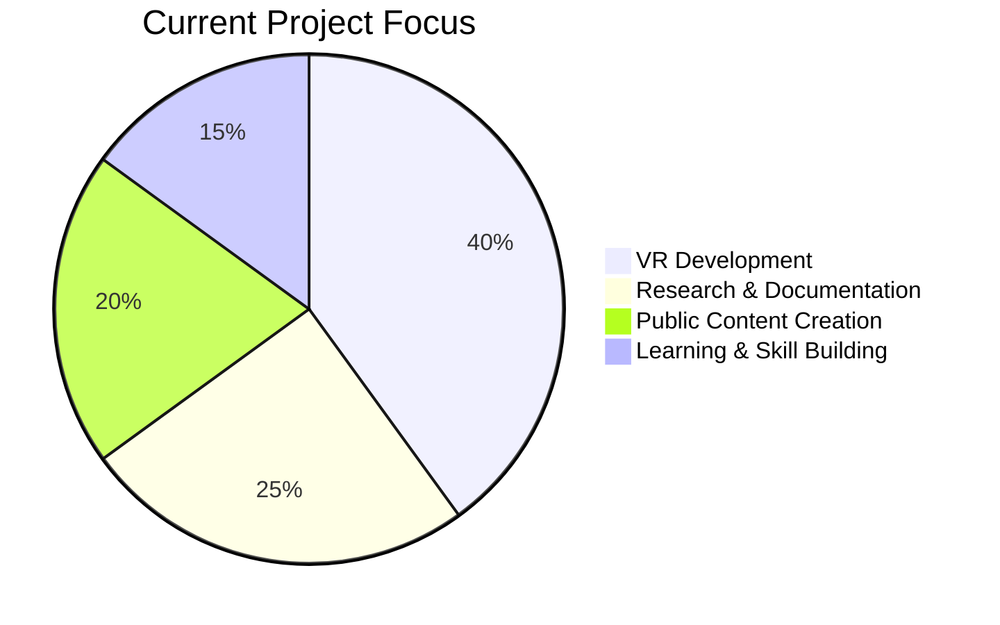

# Author Profile

## Prabhakar Deep Tirkey

> **Research Associate (RA, probation)** at DeSCINED Lab, Department of Design, IIT Delhi

### 🎯 Current Focus
- **VR Coal Mining Training Simulator** project continuation and completion
- **3-month honorary probation** → proving consistency, reliability, and delivery capability
- **Public learning journey** → livestreaming and devlogging XR development process
- **Experience design approach** → treating VR as immersive experience design (not just coding)

### 🧑‍🎓 Background
- **B.Tech** in IT & Mathematics Innovation (University of Delhi)
- **M.Sc** in Cognitive Science (IIT Delhi)
- **Research Experience** in Game Design, VR/AR, AI/Automation, EEG/BCI

### 🛠️ Skills & Expertise
- **Game Engines**: Unity (XR Interaction Toolkit), Unreal VR template
- **Programming**: C#, Python, ML/AI integration
- **Design**: User experience, interaction design, creative prototyping
- **Research**: Cognitive science, memory, attention, learning under stress
- **Specialization**: VR/AR, automation (n8n), branding, digital art

### 🧩 Philosophy
> **"VR = creating immersive experiences, not just coding mechanics"**

- Blends design science + innovation + education → aligned with DeSCINED lab's mission
- Uses build-in-public approach (livestreams, devlogs) for accountability and visibility
- Considers learning + delivering as one unified process (learn by building features)

### 📱 Connect With Me

| Platform | Link | Purpose |
|----------|------|---------|
| **Email** | [thatguypdeep@gmail.com](mailto:thatguypdeep@gmail.com) | Professional inquiries, collaboration |
| **LinkedIn** | [@prabhakar-deep](https://www.linkedin.com/in/prabhakar-deep) | Professional network, career updates |
| **YouTube** | [@prabhakardeep](https://www.youtube.com/@prabhakardeep) | Devlogs, livestreams, XR tutorials |
| **GitHub** | [@thatGuyPdeep](https://github.com/thatGuyPdeep) | Code repositories, open source projects |
| **Twitter/X** | [@thatGuyPdeep](https://twitter.com/thatGuyPdeep) | Quick updates, tech discussions |

### 🎥 Content Strategy
- **Weekly livestreams** → "Learning XR in Public" (60–90 min)
- **Unity/Unreal setup** → debugging, building immersive interactions
- **Roadmap progress** → sharing without exposing lab code
- **Short clips** → 30–60 sec for YouTube Shorts/Instagram

### 🚀 Long-Term Vision
- Build portfolio in VR, AI, and immersive design
- Create educational & safety simulations with real-world impact
- Strengthen public persona as a VR/AI creator & educator
- Secure stability through RA role, fellowships, freelancing while building creative legacy

---

## Quick Stats

---

**Backlinks**: [[00_Home/INDEX|Home Index]], [[00_Home/Project_Dashboard|Project Dashboard]]
