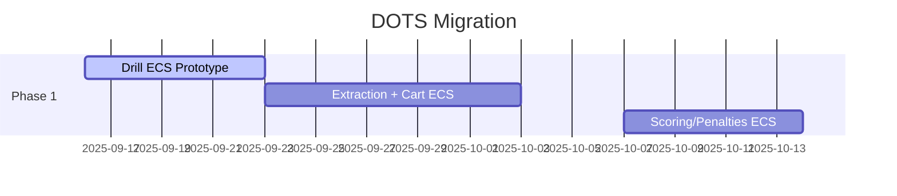
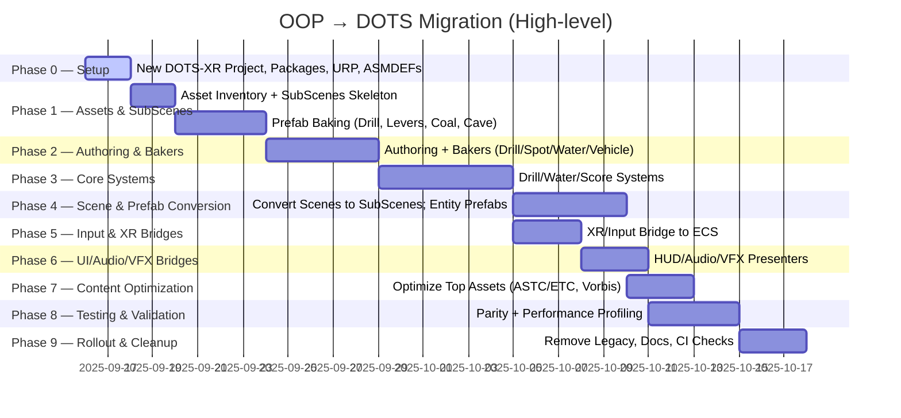

# DOTS Migration Plan — VR Coal Mining Simulator

## Goals
- Run smoothly on Quest 3 by migrating expensive OOP systems to ECS
- Preserve existing assets; use bakers/authoring to convert prefabs to entities

Reference: External detailed plan at `c:\Users\ADMIN\Documents\GitHub\VR-Mines-New-Project\Assets\artifacts\OOP_to_DOTS_Migration_Plan.md`. See also [[./VR_Coal_Mining_Simulator/External_Overview_Utilization|External Overview Utilization]] and [[./VR_Coal_Mining_Simulator/DOTS_Migration_Runbook|DOTS Migration Runbook]].

## Scope (Phase 1)
- Drill interaction and effects
- Cart and conveyor movement
- Scoring and penalty evaluation

Out-of-scope in Phase 1: full forklift parity, blasting polish, full UI migration (use bridges first).

## Migration Roadmap

### Full Timeline (Phases 0–9)

## Technical Approach
- Subscene workflow: keep scenes author-friendly; bake to entities for play
- Components: minimal `IComponentData`; blobs for static config
- Systems: update in `FixedStepSimulationSystemGroup` for physics
- Events: use `IBufferElementData` queues or `EntityCommandBuffer` for spawn/despawn

Authoring + Bakers (Phase 1 targets): DrillArm, DrillSpot, WaterLogging, Vehicle, ForkliftLift (skeleton), CoalSpawner, WearZone.

Core Systems: DrillArmControl, DrillProgress/Completion, WaterLeakStart/Raise/Lower, PumpToggle, VehicleMove, ForkliftLift, CoalSpawn, Score, Mistake, Bridges (UI/Audio/VFX).

## Packages
- Unity `Entities`, `Entities.Graphics`, `Unity Physics`, `Collections`, `Jobs`, `Burst`

XR + Bridges: XR Interaction Toolkit (classic), OpenXR, Input System → ECS input bridge.

## Performance Targets
- 72+ FPS on Quest 3
- Main thread frame time < 13 ms; CPU-bound systems Burst-compiled

Content optimization: use asset inventory outputs to compress large textures (ASTC/ETC), mesh compression, Vorbis audio quality.

## Risks
- Team familiarity with ECS; mitigate via samples and incremental migration
- Interop with XR Toolkit; isolate XR input in bridge system

Physics parity (vehicles/forklift): start hybrid (classic Rigidbody) with ECS input until DOTS physics parity.

## Milestones
- Week 1–2: Drill ECS prototype
- Week 3–4: Extraction + Cart ECS
- Week 5–6: Scoring/penalties ECS; profiling and polish

See [[./VR_Coal_Mining_Simulator/DOTS_Migration_Runbook|Runbook]] for daily steps and [[./VR_Coal_Mining_Simulator/Backlog|Backlog]] for actionable checklists.

## Phase Summaries

### Phase 0 — Setup (New DOTS-XR Project)
- Purpose: clean baseline with Entities, URP, XR, ASMDEFs.
- Outputs: fresh project, URP assets, Entities packages, XR/OpenXR, ECS folder/ASMDEF structure.
- Risks: version mismatches, XR loader quirks.
- Exit: project builds, XR rig runs, ECS code compiles separately.

### Phase 1 — Assets & SubScenes
- Purpose: reuse content safely; prepare scenes for entity conversion.
- Outputs: asset inventory (CSV/MD), SubScenes per scene, high-impact assets identified.
- Risks: heavy assets hurting Quest performance.
- Exit: target scenes have SubScenes; hotspots identified.

### Phase 2 — Authoring & Bakers
- Purpose: translate OOP data into ECS-friendly authoring.
- Outputs: Authoring + Bakers for DrillArm, DrillSpot, WaterLogging, Vehicle, ForkliftLift, CoalSpawner, WearZone.
- Risks: missing data fields; wrong TransformUsageFlags.
- Exit: baking produces correct components in SubScenes.

### Phase 3 — Core Systems
- Purpose: replace MonoBehaviour updates with ECS systems.
- Outputs: Drill control/progress/completion; Water leak/raise/lower/pump toggle; Score/Mistake; envelope bridges.
- Risks: update order bugs, unbounded per-frame work.
- Exit: Drill + Water + Score loops function in ECS test scenes.

### Phase 4 — Scene & Prefab Conversion
- Purpose: move runtime logic from GameObjects to Entities.
- Outputs: converted SubScenes; baked entity prefabs (drill, levers, pipes, coal, cave parts).
- Risks: hidden MonoBehaviour dependencies; missing references post-bake.
- Exit: scenes run primarily via ECS; classic kept only for authoring/UX.

### Phase 5 — Input & XR Bridges
- Purpose: make XR/Input System drive ECS data.
- Outputs: classic→ECS input singleton(s); XR interactions emitting ECS events.
- Risks: input latency or mapping drift.
- Exit: XR controllers reliably update ECS input each frame.

### Phase 6 — UI/Audio/VFX Bridges
- Purpose: present ECS state via classic systems.
- Outputs: HUD presenter (TMP), audio bridge (one-shot/looping), VFX bridge (particles/VFXGraph).
- Risks: main-thread spikes, GC churn.
- Exit: score/mistakes/audio/VFX reflect ECS events with stable frame time.

### Phase 7 — Content Optimization
- Purpose: hit Quest performance budgets via import settings.
- Outputs: compressed textures (ASTC/ETC), optimized meshes, tuned audio (Vorbis), shader audits.
- Risks: visual regressions; shader incompatibilities.
- Exit: inventory deltas show reduced sizes; visuals acceptable.

### Phase 8 — Testing & Validation
- Purpose: prove parity and stability.
- Outputs: parity scenarios (drill/water/vehicles/forklift/blasting), profiler captures, issue list with fixes.
- Risks: regressions under load; physics parity gaps.
- Exit: parity met; 72/90 Hz on device; no critical regressions.

### Phase 9 — Rollout & Cleanup
- Purpose: solidify ECS baseline and remove legacy.
- Outputs: removed unused OOP scripts; docs mapping authoring→components; CI checks for baking/build.
- Risks: premature deletion; undocumented behaviors.
- Exit: clean repo, documented ownership, green CI, published guidance.
