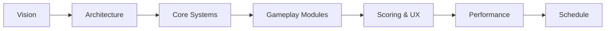
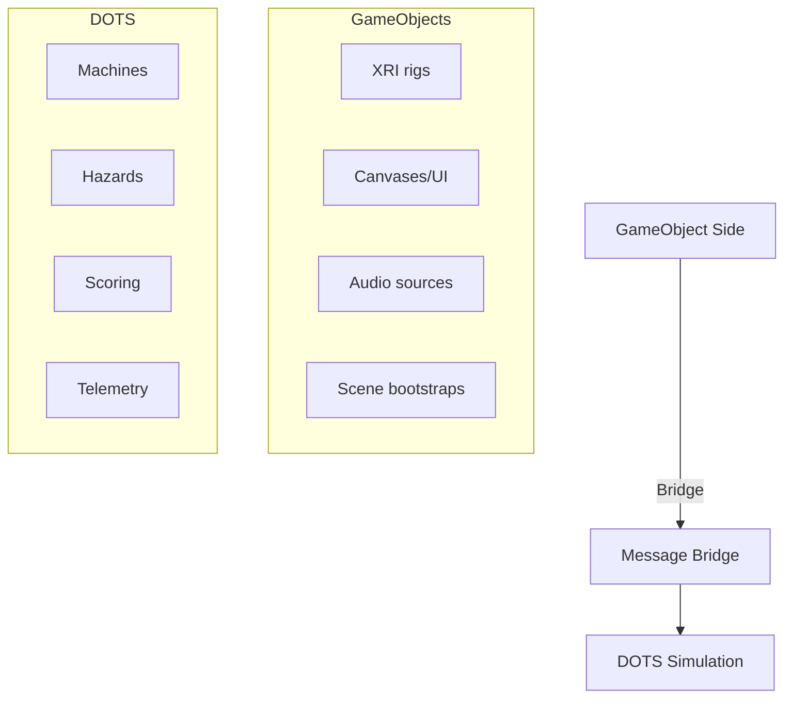
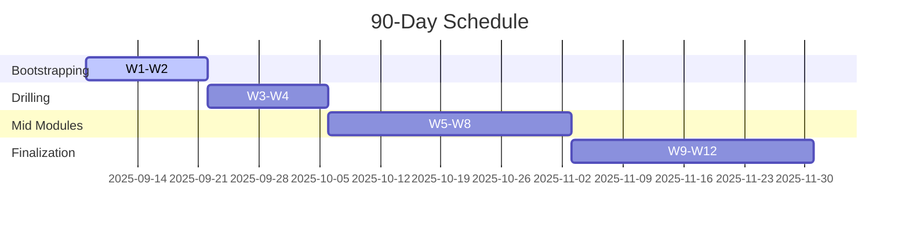

> This is the Obsidian-linked GDD. Original source: external `d:\gdd\VR_Mines_GDD.md`.

## Overview
- Owner: You
- Timeline: 90 days (ship on Day 90)
- Hubs: [[../VR_Coal_Mining_Simulator/Backlog|Backlog]] • [[../DOTS_Migration_Plan|DOTS Plan]] • [[../VR_Coal_Mining_Simulator/Features/Drill_System_DOTS|Drill System (DOTS)]] • [[../../80_Research_Notes/VR_Immersion_Factors_Training_Simulations|Immersion Research]] • [[../../90_Roadmap_Updates/90_Day_Roadmap_Update_Week1|Roadmap W1]]
- Research links: [[../../80_Research_Notes/MDA_and_Game_Design_Principles_for_VR|MDA for VR]] • [[../../80_Research_Notes/Gamification_Frameworks_Octalysis_Principles|Gamification]] • [[../../80_Research_Notes/VR_Storytelling_and_Narrative_Design|Storytelling in VR]] • [[../../80_Research_Notes/Game_Design_Fundamentals_Bible|Game Design Fundamentals — Bible]]



### 1. Vision and Goals
- High concept: A VR coal-mine training-simulation that builds operational skill and safety judgment through hands-on drills, controlled hazards, and actionable coaching.
- Success criteria:
  - Runs on Meta Quest 3 at 75–120 Hz, stable frame-time with margins (see budgets).
  - Modular curriculum of short scenarios (10–20 min) that instructors can sequence.
  - Clear KPI improvements: fewer mistakes on repeat runs; pass/fail grading aligned to safety SOPs.

### 2. Platforms, Targets, Comfort
- Target HMD: Meta Quest 3 (Horizon OS) primary; OpenXR PCVR secondary.
- Frame rates: 75/90/120 Hz modes. Performance testing at native target (no ASW during perf tests).
- Comfort defaults: Teleport + snap turn (30–45°). Smooth locomotion optional (1.25–1.75 m/s) with dynamic vignette.

### 3. Tech Stack
- Engine: Unity 2023 LTS with URP.
- XR: OpenXR Plugin + XR Interaction Toolkit (XRI) for hands/controllers.
- DOTS: Entities 1.x, Entities Graphics, Baking, Subscenes, Physics (Unity Physics for Entities). Hybrid approach: XRI + UI on GameObjects, heavy simulation in DOTS.
- Other: Addressables, TextMeshPro, Localization, Unity Profiler + Frame Timing, RenderDoc (PC), OVR utilities for device.

### 4. High-Level Architecture (Hybrid DOTS)

- Subscenes: Environments, drill targets, path nodes, hazard volumes baked to Entities.
- Data: ScriptableObjects (Scenario, ScoringWeights, HazardProfiles) baked to BlobAssets.
- Message bridge: thin event layer to translate XRI interaction to ECS commands.

### 5. Core Systems (DOTS-first)
- PPE Validation System
  - Components: `PPEState`, `PPERequirement`, `HandPresenceTag`.
  - Systems: milestone checks, raise `PenaltyEvent` if missing; GO feedback.
- Drilling Simulation
  - Components: `DrillArm`, `DrillBit`, `DrillSpot`, `RockHardness`, `CoolantState`, `OverheatState`.
  - Systems: angle/pressure → bite-rate; heat; dust; events `DrillProgressEvent`, `DrillMistakeEvent`.
- Water Logging & Pump
  - Components: `WaterVolumeProxy`, `Pump`, `HoseLink`, `PowerState`.
  - Systems: water-rise; pump throughput; thresholds; audio cues.
- Vehicles (Forklift, Mine Car, Rail Cart)
  - Components: `Vehicle`, `WheelColliderProxy` or DOTS physics, `DriverInput`, `LoadCarrier`.
  - Systems: traction, tilt, load COM checks; `CollisionPenaltySystem`.
- Hazard Manager
  - Components: `HazardSeed`, `SpawnSchedule`, `GasZone`, `RoofInstability`, `TrafficRoute`.
  - Systems: weighted spawns with cooldowns; gas spikes; roof warning → collapse if neglected.
- Scoring & Penalties
  - Components: `ScoreAccumulator`, `PenaltyEvent`, `BonusEvent`.
  - Systems: aggregate per trainee; compute grade; emit breakdown payload.
- Telemetry
  - Components: `TelemetryBuffer`, `EventTag`.
  - Systems: ring buffer of key events and metrics; optional upload when connected.

### 6. Gameplay Modules
- M0 Controls & PPE: Tutorial, calibration, PPE donning.
- M1 Drilling L1: Basic angle/pressure; 3–5 drill spots.
- M2 Drilling L2: Sequenced spots, coolant/water feed.
- M3 Drilling L3: Hazards active, tool wear, error recovery.
- M4 Water Logging: Rising water mitigated via pumps and hose setup.
- M5 Forklift Ops: Pick, transport, stack pallets/containers; traffic hazards.
- M6 Rail Cart Ride: Orientation transit (comfort cockpit frame, 60–120 s).
- M7 Blasting Prep: Layout, dummy charges, cable run, standoff verification.
- M8 Longwall/Continuous Miner Overview: Remote operation basics.
- M9 Material Handling: Joy loader → conveyor → shuttle car.

### 7. Loop & Progression
Briefing → PPE → Checklist → Execute → Randomized hazard(s) → Debrief/Coaching → Advance or Remediate.  
Canonical flows/specs: [[../VR_Coal_Mining_Simulator/GamePlay_Spec|Gameplay Spec]] • [[../VR_Coal_Mining_Simulator/Mechanics_Spec|Mechanics Spec]] • [[../VR_Coal_Mining_Simulator/User_Journey_Flow|User Journey Flow]] • [[../VR_Coal_Mining_Simulator/Design_Experience_Guidelines|Design Experience]].
Grades: A ≥90, B 80–89, C 70–79, D <70. Bronze/Silver/Gold → C/B/A.

### 8. Scoring Spec (configurable)
- Positives: drilling +200; correct pump +50; forklift placement +100; completion +500.
- Negatives: collision -50/100; off-angle drill -50; wrong position -50; missing PPE -100; unsafe proximity -150.
- Multipliers: Full-PPE +10%; No-collision run +10%.
- Stored per run; leaderboard optional.

### 9. UX & UI
- World-space panels 1–2 m; 14–18 pt @1 m. Large toggles/knobs.
- Minimal HUD; timer/score only during drills. Radio/tannoy VO; Hindi first, EN second.
- Audio ducking: VO sidechain reduces ambience/equipment by 6–9 dB.
- Accessibility: handedness, height calibration, seated reach assist, subtitles, color-safe palette.

### 10. Content & Assets
- Environments: modular tunnel kits, junctions, loading bay, pump room, water zones.
- Machines: continuous miner, forklift, rail cart, pumps, joy loader, shuttle car.
- Props: PPE, gas meter, signage, support props, pallets/containers.
- VFX: dust, debris, water spray, warning strobes, vignette.

### 11. Performance Targets (Quest 3)
- GPU budgets: 13.3 ms@75, 11.1 ms@90, 8.3 ms@120. CPU main-thread < 6 ms.
- Draw calls ≤1.2k; visible tris 1.5–2.5M; minimal transparencies; single-pass instanced stereo.
- DOTS: Burst on hot paths; `ISystem`; zero GC alloc per frame; Jobs for physics and queries.

### 12. DOTS Data Model (examples)
```text
// Components (subset)
DrillArm { float3 localAxis; float pressure; float angle; }
DrillBit { float wear; float heat; }
DrillSpot { float hardness; float progress; float3 normal; }
CoolantState { float flowRate; }
OverheatState { float heat; float cooldown; }

Vehicle { float maxSpeed; float accel; float brake; }
LoadCarrier { float3 loadCOM; float loadMass; }

HazardSeed { uint seed; float cooldown; }
GasZone { float ppm; bool alarmed; }
RoofInstability { float risk; float timeToFail; }

ScoreAccumulator { int value; }
PenaltyEvent { int delta; ushort code; }
BonusEvent { int delta; ushort code; }
```

### 13. Testing & Validation
- Heuristics: VR comfort checklist; interaction affordance passes.
- Playtests at milestones with SSQ + NASA-TLX.
- Automated perf capture: FPS histogram, CPU/GPU frame-time, entity counts; regression gates per build.

### 14. Build & CI
- Build flavors: Quest Debug, Quest Release, PCVR Dev.
- CI: bake subscenes → Addressables build → Quest AAB → sideload.
- Perf gate: meet target Hz with ≥10% margin in stress scene.

### 15. 90-Day Schedule (Week-by-Week)

- See [[../../90_Roadmap_Updates/90_Day_Roadmap_Update_Week1|Roadmap W1]] for granular tasks.

### 15b. Post-90 Polish Phase
- Performance pass 2 (GPU/CPU), memory trimming
- Audio/visual polish; localization QA; accessibility refinements
- Extended validation and trainer materials

See [[../../90_Roadmap_Updates/90_Day_Master_Plan|90-Day Build Plan + Post-90 Polish]].

### 16. Milestone DoD (each module)
- Playable start→end; all objectives tracked; hazards seed-reproducible.
- Grade computed; scoring breakdown accurate; telemetry recorded.
- Subtitles and Hindi VO present; accessibility verified.
- Quest 3 frame-time within budget in stress case.

### 17. Risks & Mitigations
- Motion sickness → teleport default, stable horizons, cockpit frames, vignettes.
- DOTS complexity → hybrid approach; author via SO → bake to Blob; limit custom render features.
- Audio masking → sidechain ducking; subtitle fallback.
- Realism vs safety → no close-range blasts; indirect feedback only.

### 18. Deliverables
- Quest 3 build (AAB) with 75/90/120 Hz modes.
- Instructor Guide PDF; Scenario authoring templates (SO + sample seeds).
- Source repo with CI, profiling docs, and living GDD.
