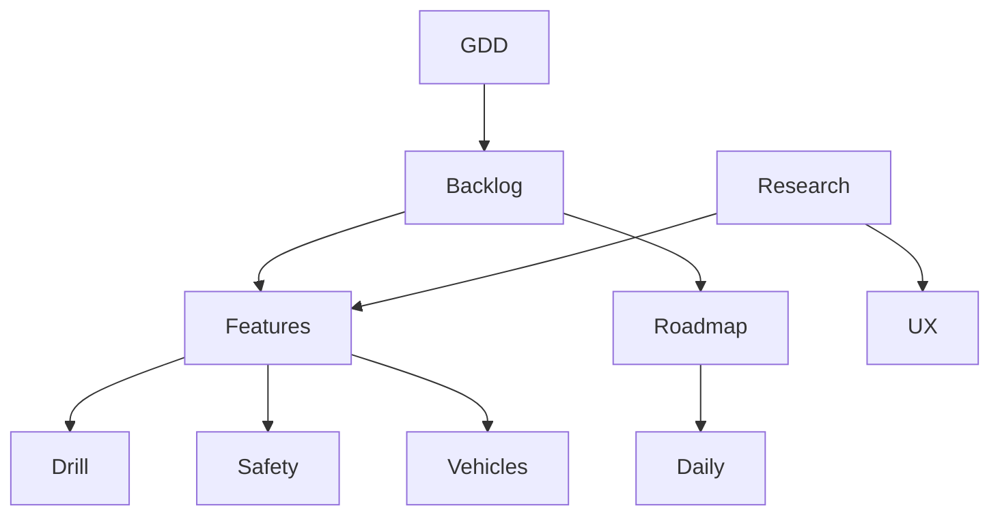
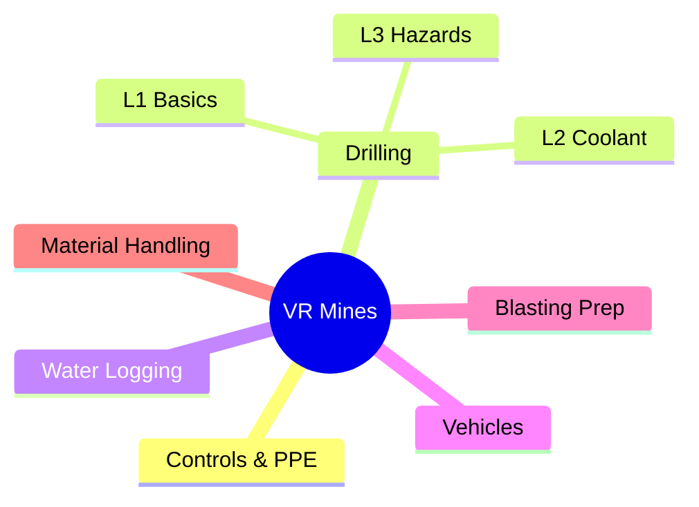
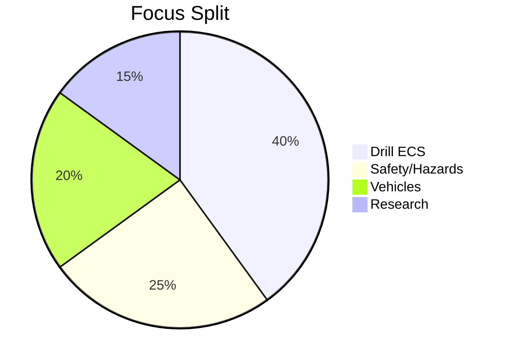

# Graph Overview — VR Mines

## Network (Concept Map)

```mermaid
graph TD
  GDD --> Backlog
  Backlog --> Features
  Features --> Drill
  Features --> Safety
  Features --> Vehicles
  Backlog --> Roadmap
  Roadmap --> Daily
  Research --> Features
  Research --> UX
```

## Mindmap (Modules)

```mermaid
mindmap
  root((VR Mines))
    Controls & PPE
    Drilling
      L1 Basics
      L2 Coolant
      L3 Hazards
    Water Logging
    Vehicles
    Blasting Prep
    Material Handling
```

## Pie — Effort Allocation

```mermaid
pie title Focus Split
  "Drill ECS" : 40
  "Safety/Hazards" : 25
  "Vehicles" : 20
  "Research" : 15
```

> [!hint] Use Graph Settings
> - Group by: Path
> - Show tags; filter `#project/vr-mines`
