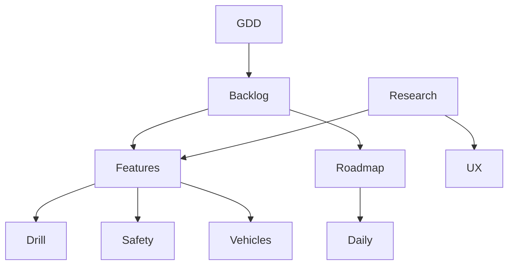
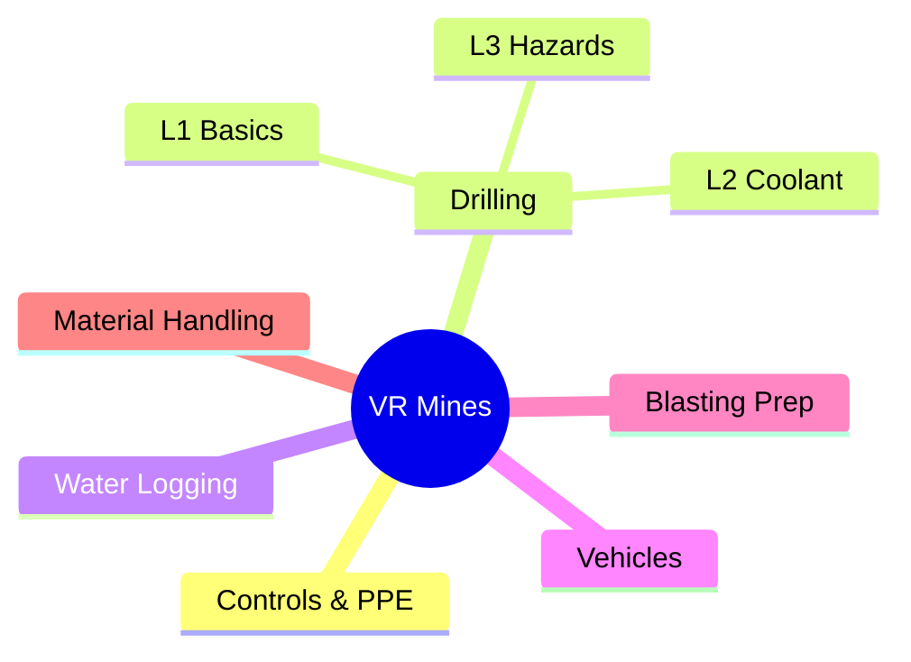
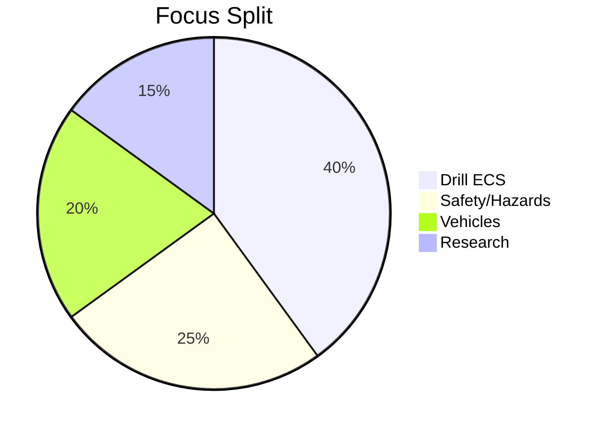

# Graph Overview

This interactive graph shows pages and their wiki-link connections. Click nodes to navigate.

---
uid: graph-overview
project: VR Mines
status: active
updated: 2025-09-15
tags: [graph]
---

# Graph Overview — VR Mines

## Network (Concept Map)

## Mindmap (Modules)

## Pie — Effort Allocation

> [!hint] Use Graph Settings
> - Group by: Path
> - Show tags; filter `#project/vr-mines`
