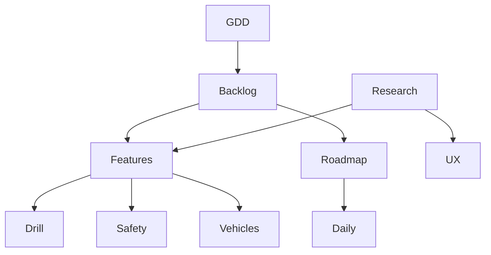
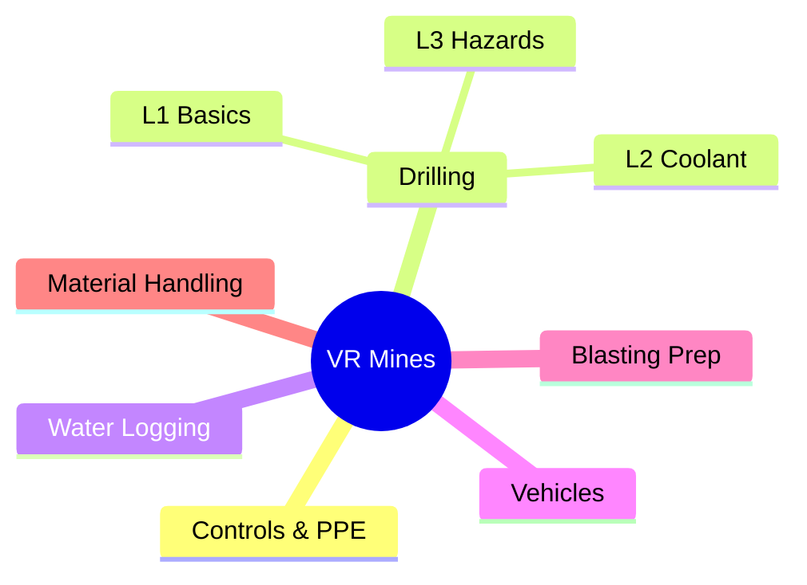
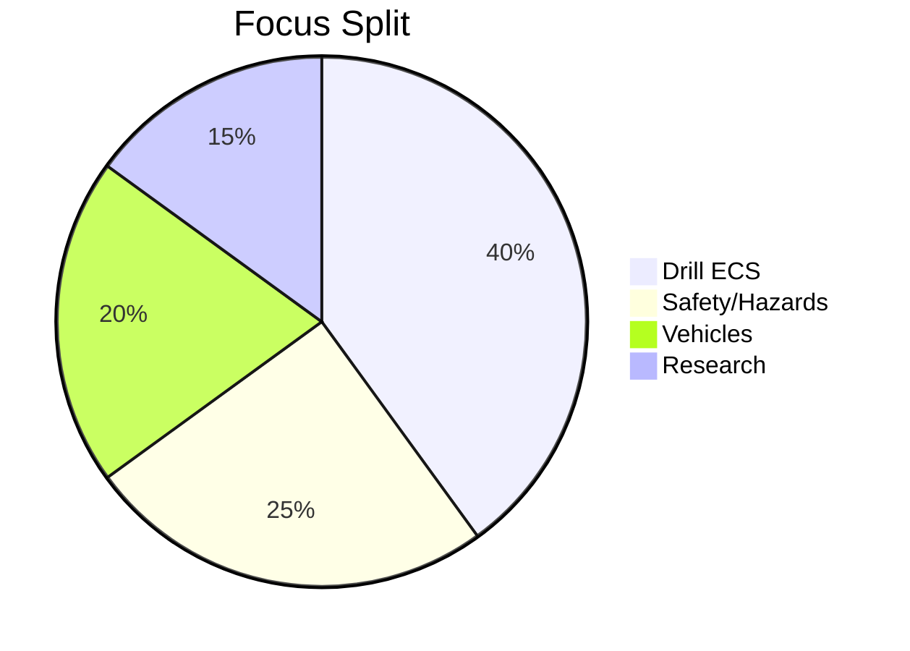

# Graph Overview

This page hosts a lightweight, self-contained graph view inspired by Obsidian’s Graph plugin settings: search, tag/path filters, and neighbor highlighting. See reference: [Obsidian Graph](https://help.obsidian.md/plugins/graph).

  

    <input id="gv-search" type="text" placeholder="Search..." />
    <input id="gv-tag" type="text" placeholder="Filter tag (e.g., #project/vr-mines)" />
    <input id="gv-path" type="text" placeholder="Filter path (e.g., 70_Project_Documentation/)" />
    <label><input id="gv-neighbors" type="checkbox" /> Neighbors-only on select</label>
    <button id="gv-reset">Reset</button>
  

  

  <noscript>Enable JavaScript to view the interactive graph.</noscript>
  

---
uid: graph-overview
project: VR Mines
status: active
updated: 2025-09-15
tags: [graph]
---

# Graph Overview — VR Mines

## Network (Concept Map)

```mermaid
graph TD
  GDD --> Backlog
  Backlog --> Features
  Features --> Drill
  Features --> Safety
  Features --> Vehicles
  Backlog --> Roadmap
  Roadmap --> Daily
  Research --> Features
  Research --> UX
```

## Mindmap (Modules)

```mermaid
mindmap
  root((VR Mines))
    Controls & PPE
    Drilling
      L1 Basics
      L2 Coolant
      L3 Hazards
    Water Logging
    Vehicles
    Blasting Prep
    Material Handling
```

## Pie — Effort Allocation

```mermaid
pie title Focus Split
  "Drill ECS" : 40
  "Safety/Hazards" : 25
  "Vehicles" : 20
  "Research" : 15
```

> [!hint] Use Graph Settings
> - Group by: Path
> - Show tags; filter `#project/vr-mines`
