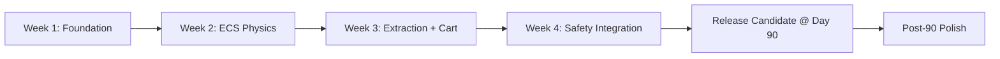
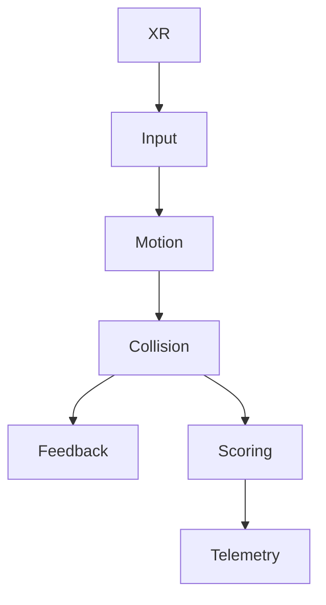
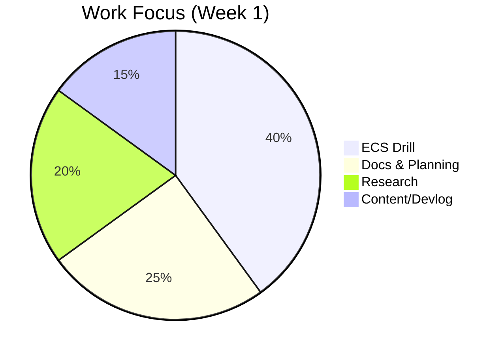

# VR Mines — Project Dashboard

> [!info] Quick Entry Points
> [[./INDEX|Home Index]] • [[./MOC_VR_Mines|MOC]] • [[../70_Project_Documentation/GDD/VR_Mines_GDD|GDD]] • [[../70_Project_Documentation/DOTS_Migration_Plan|DOTS Plan]] • [[../70_Project_Documentation/VR_Coal_Mining_Simulator/Backlog.kanban|Kanban]]

## Status Summary

| Area | Status | Owner | Notes |
|---|---|---|---|
| Drill (DOTS) | In Progress | PDT | Input/Motion systems prototyped |
| DOTS Plan | Active | PDT | Scope defined, week 2 targets |
| Roadmap W1 | Completed | PDT | Next: ECS Physics week |
| Research | Ongoing | PDT | Immersion + mining workflow |

## Milestone Flow

## Component Map

> [!tip] Graph View
> Filter by tag `#project/vr-mines` for a clean project-only network.

## Key Documents
- [[../70_Project_Documentation/GDD/VR_Mines_GDD|GDD — SafeOps]]
- [[../70_Project_Documentation/VR_Coal_Mining_Simulator/Features/Drill_System_DOTS|Drill System (DOTS)]]
- [[../70_Project_Documentation/DOTS_Migration_Plan|DOTS Migration Plan]]
- [[../90_Roadmap_Updates/90_Day_Roadmap_Update_Week1|Roadmap W1]]
- [[../70_Project_Documentation/VR_Coal_Mining_Simulator/Backlog|Backlog]]

## Workload Split

