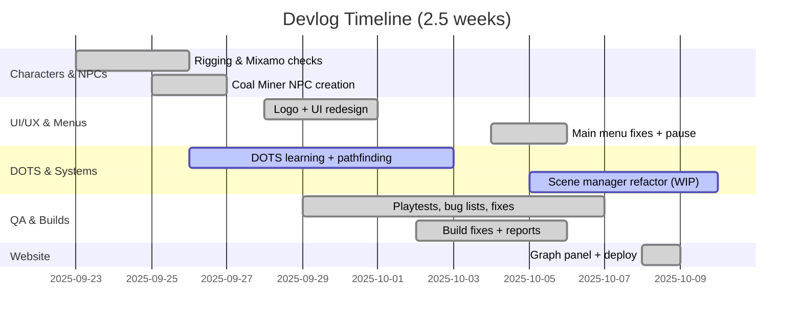

# Devlog — 2025-09-23 → 2025-10-08

> Summary of the last 2.5 weeks across gameplay, DOTS, UI/UX, tooling, and deployment.

## Highlights
- Built and deployed the website with an Obsidian-style interactive graph panel (Quartz-inspired UI).
- Rigged 3D characters and created a Coal Miner NPC; validated via Mixamo.
- Major UI redesign; created a new game logo; main menu iteration with pause integration.
- Extensive bug-fixing, playtests, and build fixes; addressed null references and singleton pitfalls.
- Progress on DOTS research and learning: Entities, pathfinding, performance sessions, and masterclasses.

## Completed
- 3D character rigging; animation tests; Coal Miner NPC generation; NPC rigging.
- Mixamo checks for player character and NPC.
- UI redesign; new logo; main menu bug fixes; pause feature; scene interlinking.
- Playtesting → bug list → fixes → rebuilds; multiple build fixes and reports.
- Fixed: null references (UI, WrongDrill detector), unsafe singletons in SceneScore Manager.
- Optimized: replaced slow lookups with `FindObject` path strategy where appropriate; smoother platform animation sequence.
- Website: graph interactions, control panel, deployment pipeline; docs updated with Graph Panel section.

## In Progress / Ongoing
- Develop a more sophisticated scene manager (array-based orchestration).
- Unity AI NPC experiments (NavMesh, Behavior Trees) and DOTS migration.
- Assets review and pipeline automation; VR art practice; Unreal setup exploration.
- Research threads: [[80_Research_Notes/MDA_and_Game_Design_Principles_for_VR|VR MDA Principles]], [[80_Research_Notes/Gamification_Frameworks_Octalysis_Principles|Gamification Frameworks]], DOTS pathfinding, Netcode for Entities.

## Blockers & Lessons
- Needed to reset Quest 3 to resolve login/config issues.
- Past incident: aggressive automation and rules caused misplaced files in editor; use automation cautiously and prefer code review-first workflows.

## Next Two Weeks (proposed)
- Finalize scene manager and migrate core systems to DOTS (drill, scoring, hazards).
- Ship a stable playtest build; focus on UX polish for onboarding and feedback flow.
- Expand graph metadata categories; add legend/neighbor focus toggle in controls.

## Links
- [[00_Home/INDEX|Home Index]] • [[Project_Directory_Index|Project Directory Index]]
- Plans: [[90_Roadmap_Updates/90_Day_Master_Plan|90-Day Master Plan]]
- DOTS: [[70_Project_Documentation/DOTS_Migration_Plan|DOTS Migration Plan]] • [[70_Project_Documentation/VR_Coal_Mining_Simulator/DOTS_Migration_Runbook|DOTS Migration Runbook]]
- GDD: [[70_Project_Documentation/GDD/VR_Mines_GDD|GDD — VR Mines]]
- Research: [[80_Research_Notes/INDEX|Research Index]]

## Timeline

---
Backlinks: [[00_Home/INDEX|Home Index]] · [[00_Home/MOC_VR_Mines|MOC — VR Mines]] · [[Project_Directory_Index|Project Directory]]

