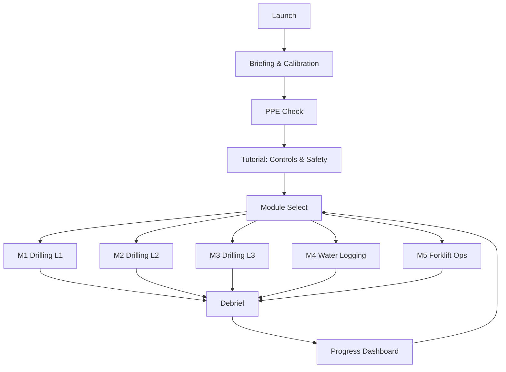
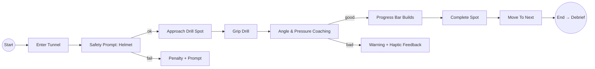
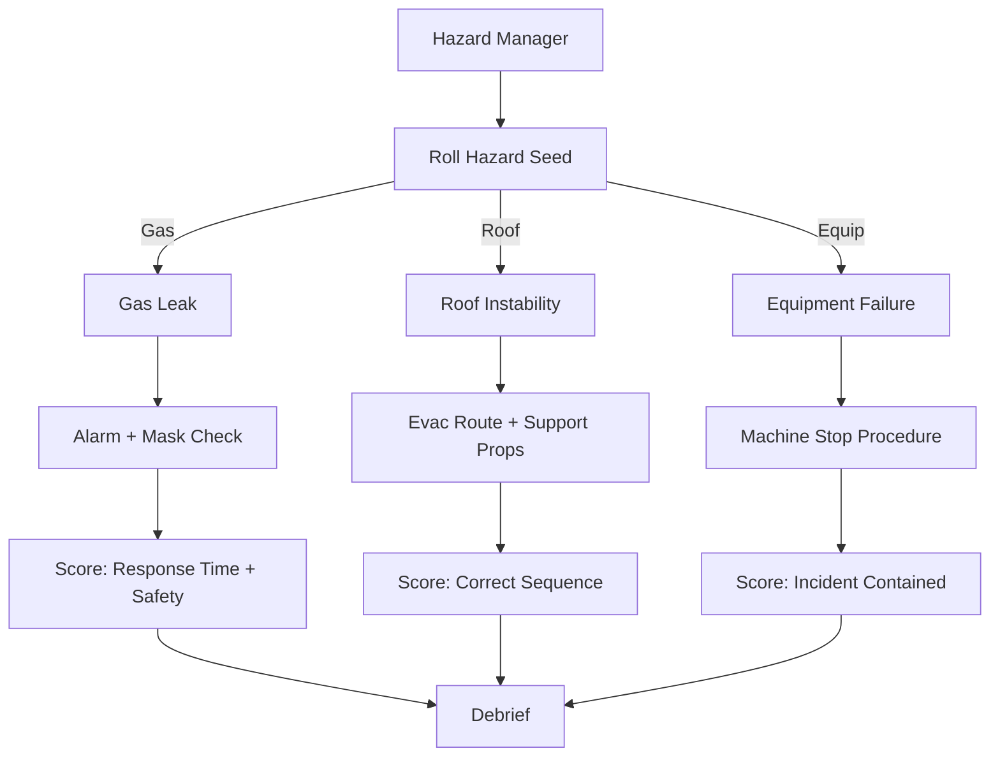
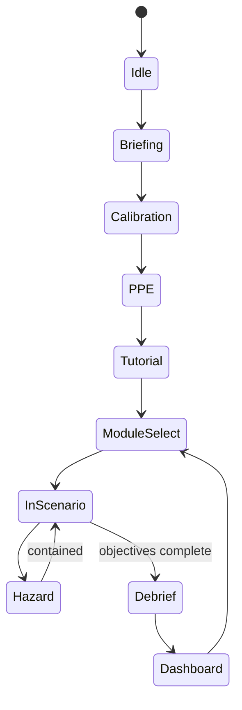

# User Flow + Storyline — VR Mines (SafeOps)

> [!info] Hubs
> [[./GDD/VR_Mines_GDD|GDD]] • [[./VR_Coal_Mining_Simulator/Features/Drill_System_DOTS|Drill (DOTS)]] • [[../80_Research_Notes/VR_Storytelling_and_Narrative_Design|VR Storytelling]] • [[./Instructor_Guide_Template|Instructor Guide]]

## 1) High-Level Flow (Act Structure)

## 2) Detailed Interaction Flow (Example: M1 Drilling L1)

## 3) Hazard Flow (Procedural Boss-Level)

## 4) Storyline Beats (Slice‑of‑Life)
- Opening VO (Dispatcher): “Shift 3, safety first. Two drills at the east face.”
- Locker Room Ritual: don PPE; minor chit‑chat about last incident (tone setting)
- On‑site Brief: instructor points to hazard signage; explains objectives
- Work Phase: steady loop of tasks; ambient radio chatter makes world feel alive
- Spike: alert tone; hazard forces decision under pressure
- Resolution: correct procedure leads to calm and praise; mistakes → coaching
- Debrief: instructor highlights positives; shows heatmap of issues; proposes micro‑quests

## 5) UX States & Transitions

## 6) Feedback & Scoring Surfaces
- In‑scenario: subtle progress bar, timer, minimal HUD
- Audio: VO guidance ducking ambience by 6–9 dB
- Haptics: graded by impact/urgency
- Debrief Dashboard: score breakdown (Efficiency/Safety/Response), badges, next micro‑quests

## 7) Data & Telemetry
- Track: infractions, reaction times, repeated errors, completion, comfort
- Store per run; show trends over sessions (streaks, improvement)

## 8) Acceptance Criteria (per module)
- Clear success/fail routes; recoverable errors
- Safety cues detectable ≤200 ms
- 72–90 Hz on Quest 3 in stress case
- Debrief suggests actionable next steps

## 9) Links
- [[./GDD/VR_Mines_GDD|GDD]] • [[./VR_Coal_Mining_Simulator/Backlog|Backlog]] • [[./VR_Coal_Mining_Simulator/Features/Drill_System_DOTS|Drill System]] • [[../90_Roadmap_Updates/90_Day_Roadmap_Update_Week1|Roadmap W1]]

