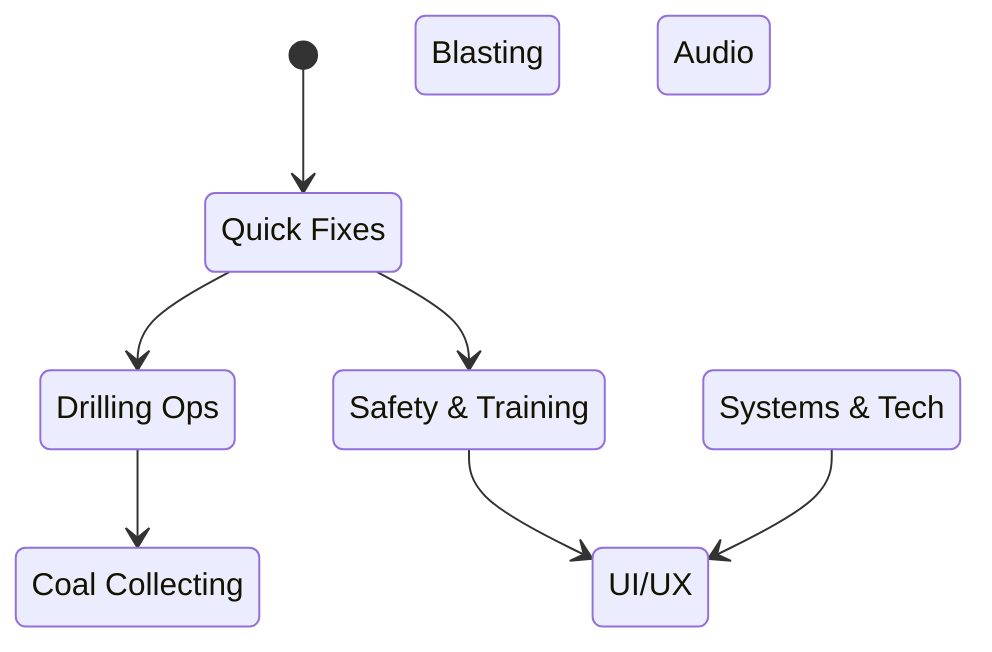

# Backlog — Features & Bug Fixes (2025-10-09)

> Consolidated from handwritten notes. Prioritized with quick wins first; numbers in parentheses are rough priority.

## Quick Fixes (High Impact)
- Homepage button shows blank screen — fix navigation target (P1)
- Player jumps out of vehicle and vehicle keeps moving — lock exit and auto-brake (P1)
- Drilling system not working in M2 — restore interaction + state flow (P1)
- Scoring system not updating — reconnect events and UI binding (P1)
- Fix jittery ramp movement — adjust animation sequence/physics (P1)

## Drilling Operations
- Implement drilling mechanism flow: rotate → aim → start → FX → hole (P1)
- Add drill interactions, sound, and particle FX (P1)
- Add collision for hole creation proxy and progression trigger (P2)

## Safety & Training Ground
- Safety check before entering the mine (completed)
- Training steps: helmet, vest, gloves, boots checks and attach flows (P2)
- Equipment check; detonation button gating; extinguisher spray behavior (P2)
- Methane detection with gas level check and alarm (P2)

## Blasting
- Current blasting doesn’t explode — add explosion particle system + gameplay outcome (P2)
- Remove explosion on proximity; require explicit arming (P3)

## Coal Collecting Level
- Fix ground colliders to prevent fall-through (P1)
- Grab coal with hands; add shovel holds and collision (P2)
- Collector vehicle: fix rotation angle; collect on collision; clamp angle for drop (P2)
- Deliver to ramp/sump for objective completion (P2)

## UI/UX
- Redesign main menu content, fix null reference paths (P2)
- Change color theme and improve feedback for interactions (P3)
- Instructions available at any point in game; context-sensitive tips (P2)

## Audio
- Add drilling SFX; environment sounds; gas alarm cues (P2)
- Add Hindi voice-overs; prepare multilingual pipeline (P4)

## Systems & Tech
- Scene Manager: array-based orchestrator (in progress)
- Add NPC 3D model and AI agent (NavMesh/BT); integrate to scenarios (P3)
- Leaderboard with social backend (P3)
- Penalty for dropping explosives; complete gameplay loop (P2)
- Implement 4 loading levels; randomized unexpected events (P3)

## Notes
- "Indian touch" content pass: 3D model accents, game feel, instructions.
- Testing and polishing after each milestone build.

## Links
- [[00_Home/MOC_VR_Mines|MOC — VR Mines]] • [[Project_Directory_Index|Project Directory Index]]
- [[70_Project_Documentation/VR_Coal_Mining_Simulator/Backlog|Canonical Backlog]]
- [[60_Devlog_Content/Devlog_2025-09-23_to_2025-10-08|Devlog — 2025-09-23 → 2025-10-08]]

## Board

---
Backlinks: [[00_Home/MOC_VR_Mines|MOC — VR Mines]] · [[Project_Directory_Index|Project Directory]]

