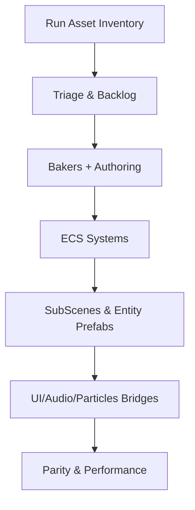

# DOTS Migration Runbook

> Daily workflow to move from MonoBehaviours to Entities. References external checklist and local analysis.

## Reference
- External checklist (Windows path): `c:\Users\ADMIN\Documents\GitHub\VR-Mines-New-Project\Assets\artifacts\DOTS_Conversion_Checklist.md`
- Local context: [[./Systems_Analysis|Systems Analysis]], [[./External_Overview_Utilization|External Overview Utilization]], [[./Overview_Condensed|Overview (Condensed)]]

## Quick Flow (Mermaid)

## Daily Steps
1. Inventory & Triage
   - Run `artifacts/gen_inventory.ps1` in the Unity repo.
   - Open `Assets_Inventory.md`; add top findings to [[./Backlog|Backlog]].
2. Authoring + Bakers
   - Create Authoring components per external checklist (DrillArm, DrillSpot, WaterLogging, Vehicle, ForkliftLift, CoalSpawner, WearZone).
   - Add Bakers producing `IComponentData`.
3. Systems
   - Implement: `DrillArmControlSystem`, `DrillProgressSystem`, `WaterLeakStartSystem`, `WaterLevelRaiseSystem`, `WaterLevelLowerSystem`, `PumpToggleSystem`, `VehicleMoveSystem`, `ForkliftLiftSystem`, `CoalSpawnSystem`, `ScoreSystem`, `MistakeSystem`.
4. SubScenes & Prefabs
   - Create SubScenes for each listed scene; bake entity prefabs.
5. Bridges
   - HUD score presenter, audio bridge, particles bridge.
6. Validation
   - Parity checks (drilling, water logging, XR interactions); performance budget.

## Checklists (copied from external, condensed)
- SubScenes: Menu, Level, Cave_Drill/L2/L3, Blasting, Control_Instruction, Safety_Inst
- Prefab Baking: drill machine, levers, pipes, coal, cave
- Authoring Components: DrillArm, DrillSpot, WaterLogging, Vehicle, ForkliftLift, CoalSpawner, WearZone
- Systems: listed in Daily Steps
- Data Components: DrillArm, DrillSpot, WaterLogging, Vehicle, ForkliftLift, Liftable, Score (+ScoreEvent), Mistakes
- Bridges: HUD, Audio, Particles
- Input: map actions → ECS components (XR axes/buttons)
- Rendering/Shaders: URP audit; replace Surface Shaders
- Performance: run inventory; optimize imports (ASTC/ETC, Vorbis)
- Validation: behaviour parity; VR interaction parity; frame time

## Next Actions
- Create tasks in [[./Backlog|Backlog]] per module and link to features (e.g., [[./Features/Drill_System_DOTS|Drill System (DOTS)]]).
- Update [[./Systems_Analysis|Systems Analysis]] matrices as you complete conversions.

