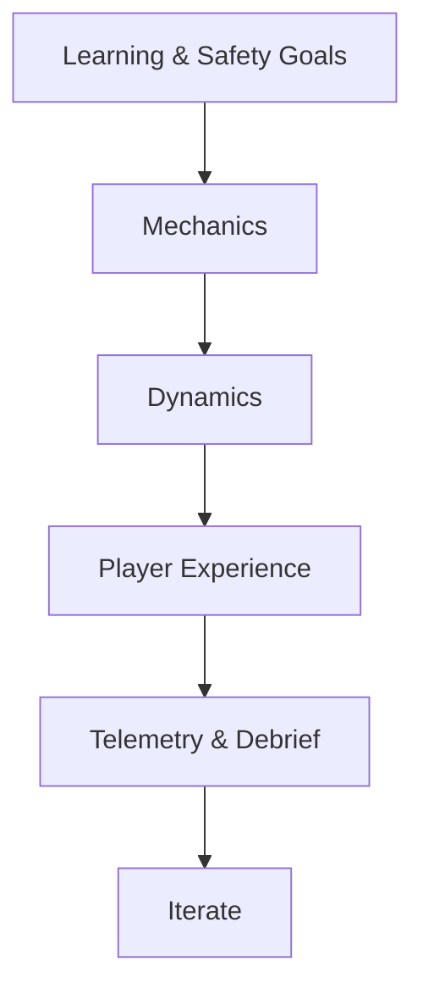

# Design Experience Guidelines

Links: [[../../80_Research_Notes/Game_Design_Fundamentals_Bible|Game Design Fundamentals — Bible]], [[./Gameplay_Spec|Gameplay Spec]], [[./User_Journey_Flow|User Journey Flow]]

## Design Principles
- Meaningful choices over busywork; align mechanics with learning goals.
- Teach-first onboarding; defer edge cases.
- Clarity: visible costs, timers, and hazard states.

## Flow & Pacing
- Keep decisions within skill band; use soft hints and catch-up valves.

## Feedback & Aesthetics
- Combine audio, haptics, visual cues; immediate feedback for safety actions; positive reinforcement for proactive behavior.

## Accessibility Standards
- Comfort options, readable UI, color-safe palette, left/right-hand parity, standing/seated.

## Rulebook & Aids
- Maintain in-VR reference: objectives, turn summary, icon legend, scoring.

## Evaluation & Playtesting
- Blind tests for rule clarity; metrics on confusion points; iterate per protocol in the Bible.

## Diagram — Experience Stack

Backlinks: [[./INDEX|Simulator Index]]

