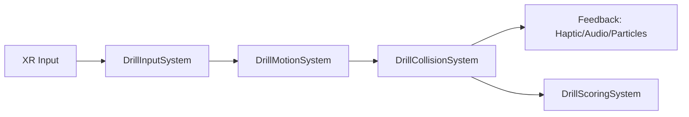

# Drill System (DOTS/ECS)

## Purpose (Training Experience Goal)
- Teach safe and efficient drilling operations using a data-oriented, performant implementation suitable for Quest 3.

## Architecture

## Implementation (Unity DOTS)
- Packages: `Entities`, `Entities.Graphics`, `Unity Physics`, `Collections`, `Mathematics`
- Authoring: Baker converts existing drill prefab to entities (subscene)
- Components (IComponentData):
  - `DrillTag`, `DrillHead`, `DrillInput`, `DrillState`, `ImpactMaterial`
- Systems:
  - `DrillInputSystem` — reads XR input → `DrillInput`
  - `DrillMotionSystem` — applies torque/position based on `DrillInput`
  - `DrillCollisionSystem` — detects hits, spawns particles/audio events
  - `DrillScoringSystem` — updates performance metrics
- Data Flow: Input → Motion → Collision → Feedback → Scoring

## Immersion Factors
- Haptics: strength mapped to torque and material density
- Spatial audio: impact type, distance attenuation, reverb zone
- Visual: particles, decals; URP-friendly effects
- Comfort: capped angular velocity; camera-stable feedback cues

## Validation
- Benchmarks on Quest 3: 72+ FPS target
- User tests: task success, error rate, comfort score
- Telemetry: torque variance, contact time, overshoot incidents

## Future Enhancements
- Material-specific drill bits and wear
- Instructor ghosting/replay
- Adaptive difficulty using performance trends
