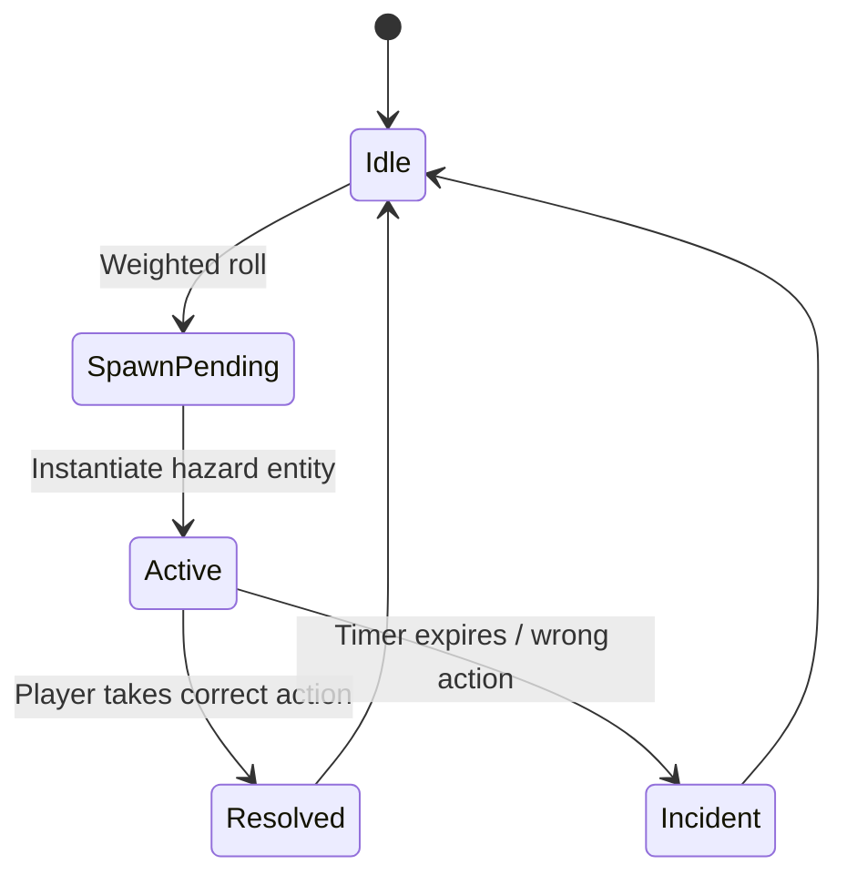

### Feature: Procedural Hazards + Gamification

> [!tip] Purpose
> Create unpredictable hazard scenarios that reward correct safety behavior and motivate repeated training.

#### Scope
- Hazards: roof rockfall, gas leak, cable fire.
- Systems: DOTS-based spawners, detection volumes, scoring, badges.
- Platforms: Meta Quest 3 (standalone).

#### Design
- Hazard Graph: weighted probabilities per zone; seedable for reproducible tests.
- PPE Check System: headlamp, helmet, respirator → gates points/penalties.
- Feedback: on-screen HUD, audio cues, haptics; debrief dashboard with rubric.

#### DOTS Implementation Notes
- Entities: `Hazard`, `PPEStatus`, `ScoreEvent`.
- Systems: `HazardSpawnSystem`, `HazardResolveSystem`, `ScoreSystem`.
- Burst: vector checks for proximity; jobs for scoring aggregation.

#### Validation
- Success: Increasing correctness across sessions; time-to-response decreases.
- Telemetry: incidents per session, PPE violation rate, badge unlocks.

#### Links
- Research tie-in: [[../../../../80_Research_Notes/Week_03_Research_Synthesis|Week 3 Research Synthesis]].
- Related: [[../Mechanics_Spec|Mechanics Spec]] • [[../DOTS_Migration_Runbook|DOTS Runbook]].

---
Backlinks: [[../INDEX|Simulator Index]] • [[../../Project_Directory_Index|Project Directory Index]].

