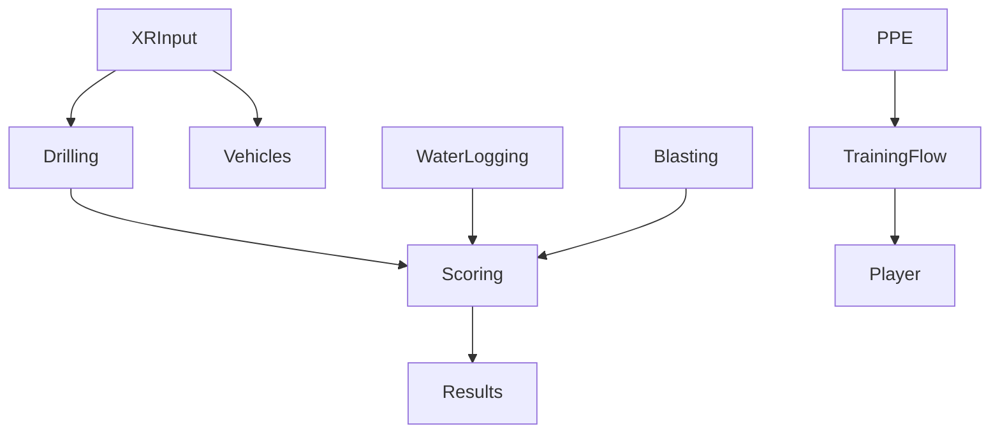

# VR Mines — Condensed Overview

> Summary adapted from the external overview for local reference. See [[./External_Overview_Utilization|External Overview Utilization]] for the full source and inventory workflow.

## Purpose
- VR mining training simulator covering PPE, driving, drilling, blasting, and water-logging mitigation with guided audio/UI and scoring.

## Architecture & Stacks
- Unity + XR Interaction Toolkit; OpenXR + Oculus; URP; Input System; TextMeshPro.
- State: `Scene1ScoreManager` (per-scene), `GlobalScoreManager` (cross-scene), `GlobalLevelResult` (final).

## Key Systems
- Drilling: `DrillArmController`, `DrillSpot` (progress/timers), FX and audio.
- Water Logging: `WaterLogging` leak → pump → lower water → bonus.
- Vehicles: `CarController`; `ForkControllerHoldInput` (lift/attach, audio).
- Safety/Training: `ClothingWearZone`; `TrainingFlowManager` audio-driven.
- Scoring/UI: `Scene1ScoreManager` events and grade; global tally; popups/HUD.
- Flow/UX: `RestartScene`, `Instruction` triggers.

## Scenes
- Menu_Scene; Level_Scene; Cave_Drill / L2 / L3; Blasting_Scene; Control_Instruction_scene; Safety_Inst_scene; loginPage.

## Gameplay & Scoring Highlights
- Positive: drill +200; pump on +50; water decrease +2/2s; final +500; blasting +50/socket.
- Negative: obstacle -50; wall -100; abort -50; wrong drill -50.
- Grade thresholds O/A/B/C/D; mistakes tracked in `GlobalLevelResult`.

## User Flow
Launch → Menu → (Controls, Safety) → Level Select → Drill module (PPE→drive→drill→water logging→score) or Blasting → Results → Menu.

## DOTS Migration (Essentials)
- Assets: reuse models/textures/materials/animations/audio/shaders (check URP); convert prefabs/scenes; refactor scripts.
- Authoring+Bakers: drill arm, drill spot, water logging, vehicles, forklift, coal spawner.
- Systems: `DrillingSystem`, `WaterLevelSystem`, `PumpInteractionSystem`, `VehicleControlSystem`, `PPEWearSystem`, unified `ScoreSystem` with `ScoreEvent` buffers.
- SubScenes: split static vs dynamic; bake entity prefabs.
- UI Bridge: HUD reads ECS singleton/buffers; audio via one-shot/looping component state.

## Overview Diagram

## Links
- [[./Systems_Analysis|Systems Analysis]] • [[./External_Overview_Utilization|External Overview Utilization]] • [[../DOTS_Migration_Plan|DOTS Migration Plan]] • [[../XR_to_DOTS_Bridge_Plan|XR → DOTS Bridge Plan]]

