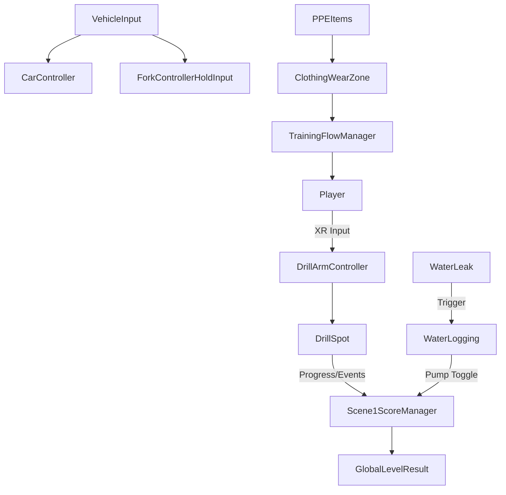
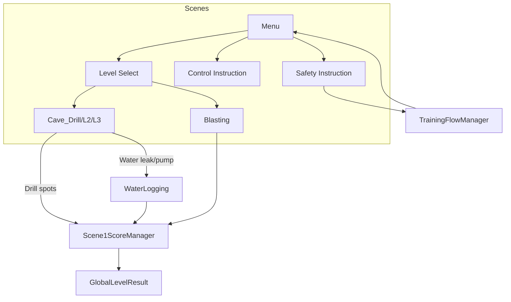

# VR Coal Mining Simulator — Systems Analysis

> Consolidated deep-dive of scenes, systems, gameplay mechanics, scoring, storyline, and end-to-end flow. DOTS migration notes included. For detailed specs see: [[./Gameplay_Spec|Gameplay Spec]] • [[./Mechanics_Spec|Mechanics Spec]] • [[./User_Journey_Flow|User Journey Flow]] • [[./Design_Experience_Guidelines|Design Experience Guidelines]].

## Purpose
- Provide a clear map of how current OOP systems interact and what carries over to DOTS.
- Identify reusable assets, refactor targets, and flow dependencies.

## Scene Overview
- Menu_Scene: main entry, navigation to modules.
- Level_Scene: module/level selection.
- Cave_Drill / Cave_Drill_L2 / Cave_Drill_L3: drilling scenarios, water logging integration.
- Blasting_Scene: explosive prep and execution.
- Control_Instruction_scene: control guidance.
- Safety_Inst_scene: PPE training.
- loginPage: basic login UI.
- SampleScene: unused/scratch.

## Core Systems
- Drilling: `DrillArmController`, `DrillSpot`, particles/audio/UI.
- Water Logging: `WaterLogging` leak→raise→pump→lower loop.
- Vehicles: `CarController`, `EnterCar`, `VehicleEntryManager`, `ForkControllerHoldInput`.
- Scoring: `Scene1ScoreManager`, `GlobalScoreManager`, `GlobalLevelResult`.
- PPE/Safety: `ClothingWearZone`, `WearGear`, `GloveWearHandler`.
- Training Flow: `TrainingFlowManager` (audio-guided steps).
- UX/Flow: `RestartScene`, `Instructions`, pause, performance HUD.
- Content: caves, levers, drill machine, coal assets, URP lighting assets.

## XR & Input Stack
- OpenXR + Oculus (see `XR/XRGeneralSettingsPerBuildTarget.asset`).
- XR Interaction Toolkit for grabs/interactions.
- Input System actions (`InputSystem_Actions.inputactions`) for Player/UI incl. XR bindings.

## Gameplay Mechanics
- High-level summary below; full rules and tunables in [[./Mechanics_Spec|Mechanics Spec]].
  - Drill arm control: smooth axis mapping with clamps; audio cues on mode changes.
  - Drill spots and progression: collider-driven progress, UI slider, score updates, level counters.
  - Water logging: delayed leak, rising water, pump toggle, lowering coroutine, audio fades, scoring bonuses.
  - Vehicles: car Rigidbody control; forklift lift/attach with navigation aids.
  - PPE: zone-detected wear states, integration with training steps.
  - Coal handling: randomized coal heap spawning.

## Scoring Model
- See [[./Gameplay_Spec|Gameplay Spec]] for scoring clarity and progression rules.
- Events: collisions (-50/-100), drill success (+200), abort (-50), wrong drill (-50), pump on (+50), water decreasing (+2/2s), final bonus (+500), blasting sockets (+50 each), blast button (+config).
- Per-scene manager handles HUD/audio; `GlobalLevelResult` captures totals, mistakes, grade.

## User Storyline & Flow
Refer to [[./User_Journey_Flow|User Journey Flow]] for the canonical onboarding and assessment path.
1. Welcome + instructions → PPE wear → explore → proceed to mine.
2. Operate vehicle(s) to site.
3. Drill designated spots; handle water logging emergency via pump.
4. Blasting preparation and execution.
5. Results packaged and returned to menu; repeat modules.

## System Interaction Diagram

## Scene → Prefabs/Scripts Mapping (high-level)
- Cave_Drill(+L2/L3): drill machine prefab, multiple DrillSpot triggers, WaterLogging setup, score HUD, instruction triggers.
- Blasting_Scene: blasting sockets prefabs, blast button, scoring UI.
- Safety_Inst_scene: PPE items with `ClothingWearZone`, narration triggers.
- Control_Instruction_scene: controller hint UI, interaction samples.
- Menu_Scene / Level_Scene: UI canvases with navigation events.

### Scene → Prefab/Script Matrix
| Scene | Key Prefabs/Objects | Key Scripts | UI/HUD | XR/Input | Notes |
|---|---|---|---|---|---|
| Menu_Scene | MenuCanvas, Buttons | (Button onClick → scene loaders) | Main Menu UI | UI Action Map | Ensure `SceneLoader` or `SceneManager` usage consistent |
| Level_Scene | LevelButtons, BackButton | (onClick handlers) | Level Select UI | UI Action Map | Links to drilling, blasting, safety scenes |
| Cave_Drill | DrillMachine, DrillSpots xN, Pump, WaterVolume, CoalHeaps | `DrillArmController`, `DrillSpot`, `WaterLogging`, `Scene1ScoreManager`, `Instructions` | Score HUD, Progress Slider, Prompts | Player/XR maps | Integrates drilling + water logging |
| Cave_Drill_L2 | As above (more spots) | Same as Cave_Drill | HUD + extra prompts | Same | Increased difficulty/quantity |
| Cave_Drill_L3 | As above (max spots) | Same as Cave_Drill | HUD | Same | Advanced timing/precision |
| Blasting_Scene | ChargeSockets, BlastButton | `Scene1ScoreManager`, socket trigger scripts | Socket prompts, score popups | Player/XR maps | Configurable blast score |
| Safety_Inst_scene | PPE: Helmet, Jacket, Gloves, Boots | `ClothingWearZone`, `WearGear`, `GloveWearHandler`, `TrainingFlowManager` | Safety prompts | Player/XR maps | Must call `MarkGearWorn` |
| Control_Instruction_scene | ControllerBoards, Interactables | `Instructions` | Instruction UI | Player/XR maps | Tutorialized controls |
| loginPage | LoginCanvas | (UI only) | Login UI | UI Action Map | Optional entry |

## Per-scene DOTS Migration Checklists
- Menu_Scene
  - Replace onClick loaders with central SceneLoad system or stay OOP.
  - Ensure UI events do not block ECS bootstrap/subscenes.

- Level_Scene
  - Convert level metadata to ScriptableObjects (data-only) or ECS config.
  - Wire to ECS scene streaming if using subscenes.

- Cave_Drill / L2 / L3
  - Create `DrillSpotAuthoring` + Baker → `DrillSpotData` (requiredTime, id, state).
  - Convert `DrillArmController` input to ECS `DrillInputData` via XR bridge.
  - Implement `DrillingSystem` to evaluate contact/progress and raise `DrillEvent`.
  - Author `WaterLoggingAuthoring` + Baker → `WaterLoggingData` (maxY, minY, rates).
  - Implement `WaterLevelSystem` and `PumpInteractionSystem` (events → score).
  - Replace `Scene1ScoreManager` with ECS `ScoreSystem` + UI binding.
  - Move audio to `OneShotAudioRequest`/`LoopingAudioState` components and systems.

- Blasting_Scene
  - Author sockets and blast button as ECS interactables (`InteractableTag`, `BlastConfig`).
  - Implement `BlastingSystem` publishing score events and completion flag.
  - Bind prompts via UI read model from ECS.

- Safety_Inst_scene
  - Author PPE zones → `PPEZoneData` (tags/types).
  - Implement `PPEWearSystem` producing progression events for `TrainingFlow`.
  - Convert `TrainingFlowManager` to data-driven step graph (BlobAsset) + system.

- Control_Instruction_scene
  - Keep OOP UI or convert to ECS read-only presentation; ensure input mapping parity.

- Vehicles (shared across scenes)
  - Bridge XR/Input → `VehicleInputData`.
  - Author physics state to ECS or keep Hybrid (Rigidbody with ECS control).
  - Implement `VehicleControlSystem`; validate forklift attach as component state.

- Cross-cutting
  - Establish `ScoreEvent` buffer and `ScoreTotals` singleton; unify grading logic.
  - Replace `GlobalLevelResult` with ECS singleton + serialization on scene exit.
  - Subscene split: static environment meshes vs dynamic ECS entities.
  - Replace `SceneLoader.Instance` with a single loading pathway.

## Risks & Gaps
- `SceneLoader.Instance` referenced; ensure presence or replace with `SceneManager.LoadScene`.
- PPE wear should call `TrainingFlowManager.MarkGearWorn` to advance flow.
- Forklift lifting dependencies: validate partner scripts/null-checks.
- Score managers overlap; define canonical aggregation path.
- Tags required: `DrillTip`, `Liftable`, `PlayerVehicle`, PPE tags.

## DOTS Migration Guidance (target state)
- Data: Convert MonoBehaviours to Authoring + Bakers → IComponentData (e.g., DrillSpotData, WaterLoggingData, VehicleState, PPEState).
- Systems: ECS Systems for drilling progression, water level simulation, scoring aggregation, vehicle input/physics bridges.
- Subscenes: Split scene content; author ECS-friendly subscenes for streaming.
- Input bridge: map Input System to component events (XR to DOTS bridge, see [[../XR_to_DOTS_Bridge_Plan|XR → DOTS Bridge Plan]]).
- Scoring: unify into a single ECS `ScoreSystem` with event components; UI reads from runtime singleton buffer.
- Audio/FX: trigger via components (OneShotAudioRequest, LoopingAudioState).

## Immediate Improvements (even before DOTS)
- Replace `SceneLoader` usage; centralize scene loading.
- Decouple static counters in `DrillSpot` → instance state.
- Consolidate `GlobalScoreManager` vs `Scene1ScoreManager` roles.
- Add results UI prefab decoupled from scenes.

## Links
- [[./INDEX|Simulator Index]] • [[../DOTS_Migration_Plan|DOTS Migration Plan]] • [[../XR_to_DOTS_Bridge_Plan|XR → DOTS Bridge Plan]] • [[../User_Flow_Storyline|User Flow + Storyline]]
- Specs: [[./Gameplay_Spec|Gameplay]] • [[./Mechanics_Spec|Mechanics]] • [[./User_Journey_Flow|User Journey]] • [[./Design_Experience_Guidelines|Design Experience]]

---
Backlinks: [[../GDD/VR_Mines_GDD|GDD]] • [[../../Project_Directory_Index|Project Directory Index]] • [[../../00_Home/MOC_VR_Mines|MOC VR Mines]]

