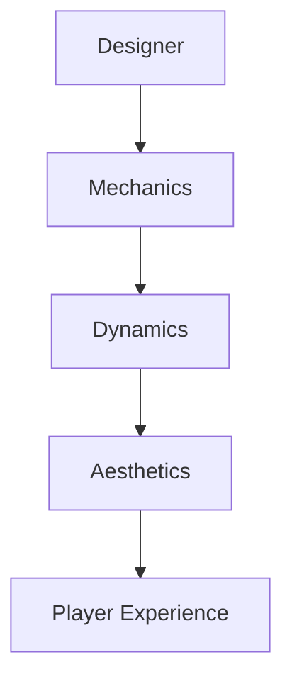
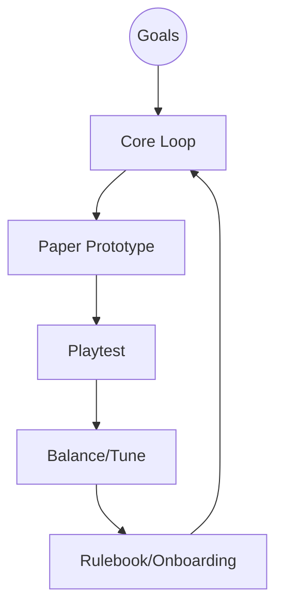
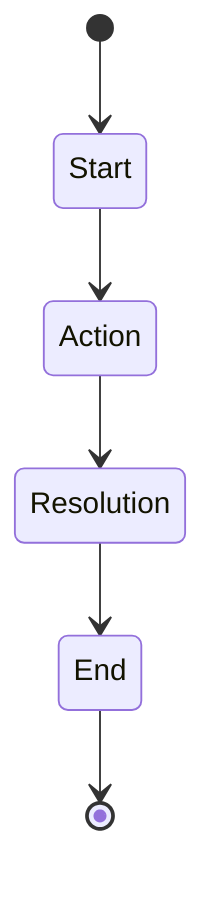
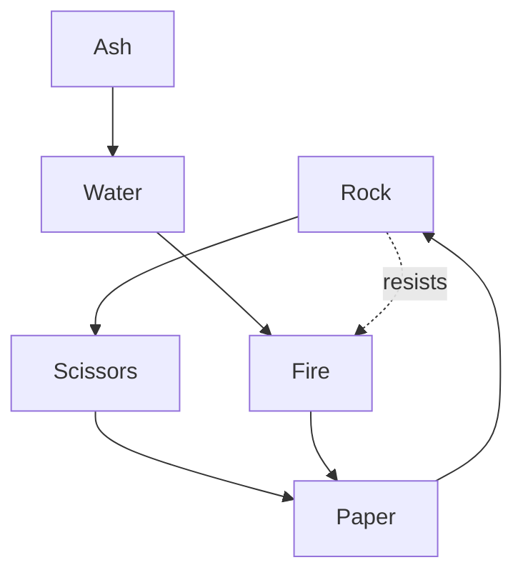
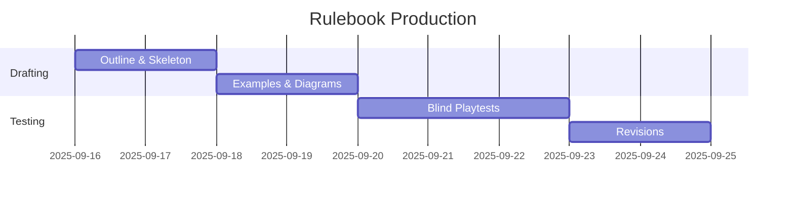
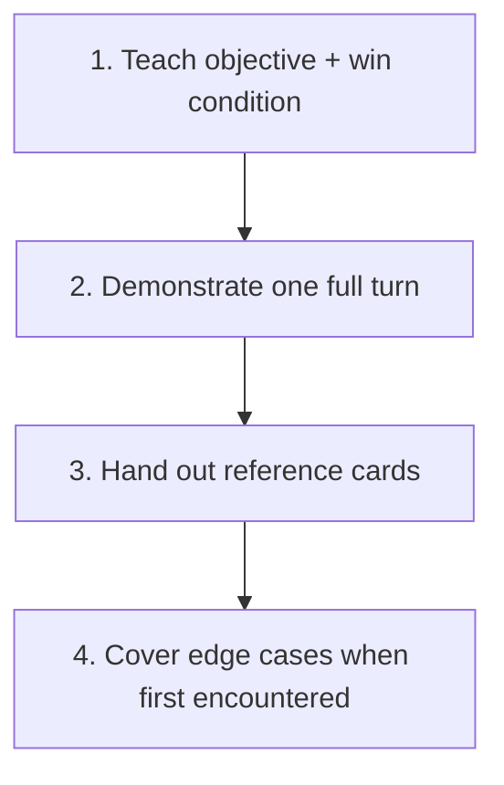

# Game Design Fundamentals — Comprehensive Bible

> Purpose: Synthesize course DDL810 notes into a practical, Obsidian-friendly handbook you can design, prototype, and evaluate games with. Use as a reference while building VR training and non-VR games.

Links: [[../70_Project_Documentation/Design_Brief_Game_Design_Gamification|Design Brief]], [[./MDA_and_Game_Design_Principles_for_VR|MDA & VR Principles]], [[./Gamification_Frameworks_Octalysis_Principles|Gamification Frameworks]], [[./VR_Immersion_Factors_Training_Simulations|VR Immersion]]

## 1) What Is A Game? Working Definition
- **Structure of rules** that shape activity into meaningful play.
- **Multiple/Infinite possibility spaces** emerge from simple rule sets; depth arises from player choices, uncertainty, and feedback.
- **Second-order design**: designers specify Mechanics; players experience Aesthetics via Dynamics.

## 2) MDA Framework (Mechanics → Dynamics → Aesthetics)
- **Mechanics**: rules, actions, constraints, resources, information, randomness.
- **Dynamics**: system behaviors over time (economies, bluffing, alliances, meta). Emergent.
- **Aesthetics**: felt experience: challenge, discovery, fellowship, narrative, expression, submission, fantasy, sensation.

Designers tune M to influence D that evoke A. Players reason backwards from A to D/M as they learn.

## 3) Core Design Process (Iterative)
1. **Identify objectives**: learning goals, fantasy/theme, target audience, constraints.
2. **Choose core loop + verbs**: what players do each turn; how they win/lose.
3. **Paper prototype quickly**: components, board, cards, tokens. Play within 10–30 minutes.
4. **Playtest**: observe confusion, decision quality, pacing; collect data.
5. **Balance & refine**: tune costs, probabilities, timing; remove complexity that doesn’t create meaningful choice.
6. **Rulebook & onboarding**: teach-first experience, examples, glossary.

## 4) Anatomy of a Turn (Template)
- **Start**: upkeep, draw, refresh.
- **Action phase**: play one or more action cards; move; trade; place obstacles/resources; manipulate timers.
- **Resolution**: apply effects, resolve conflicts (priority → timing → randomness → tie-breakers).
- **End**: check win conditions; discard; pass priority.

## 5) Mechanics Toolkit (from notes)
- **Actions/Verbs**: draw, play, move, exchange, steal, trash, place, trade, nudge, double-acting, reveal, block, sabotage, rule-change.
- **Resources**: cards, energy/time, velocity/momentum, currency, wildcards.
- **Chance**: dice, shuffled decks, hidden information; use to create uncertainty but avoid removing agency.
- **Constraints**: zones, friction areas, paths, timers, cooldowns, hand limits.
- **Interaction**: cooperation, competition, negotiation, take-that, role abilities.
- **Economy**: costs, sinks, scarcity, conversion rates; ensure earn/spend loops.
- **Conflict Resolution**: deterministic priority → modifiers → randomness; provide transparent tie-breakers (e.g., momentum calc).

### 5.1 Balancing RPS+ (Extended Dominance Graph)
Expand beyond rock–paper–scissors to more nodes with counters. Build a directed graph; keep cycles short and readably teachable.

## 6) Educational Game Design Notes (DDL810)
- **Characteristics**: simpler complexity, room for experimentation, repeatability, reinforcement, social learning contexts.
- **Learning goals mapping**: specify knowledge/skill → choose assessment moment inside play → align feedback.
- **Scaffolding**: increasing difficulty, layered challenges, clear rules, immediate feedback, safe failure.
- **Flow**: match challenge to skill; ramp carefully; avoid boredom/anxiety by tuning action point budgets and decision load.

### 6.1 Physics Theme Example (Forces & Motion)
- Goals: friction, inertia, Newton’s 2nd law, momentum, energy transfer.
- Core loop: draw → play force/obstacle/distance cards → move a piece on a board with friction zones/inclines → compute quick outcomes (e.g., momentum) for tie-breakers.
- Components: board with zones/paths, obstacle tokens, velocity trackers, timers.
- Optional role powers: engineer (ignores friction zones), physicist (convert momentum), inspector (late sabotage).

## 7) Gamification & Motivation
- Use game elements in non-game contexts thoughtfully. Favor **meaningful choices** and **autonomy/competence/relatedness** (Self-Determination Theory).
- Octalysis lenses: accomplishment, ownership, scarcity, unpredictability, social influence, meaning, empowerment, avoidance. Map chosen drives to mechanics.
- Trackers: progression bars, resource meters, time budgets. Avoid extrinsic-only loops that crowd out intrinsic motivation.

## 8) Inclusivity, Accessibility, and Audience
- Write for broad audiences; ensure clear language and cultural sensitivity.
- Components: high-contrast colors, iconography, large fonts; minimize dexterity burdens.
- Cognitive load: chunk rules; provide player aids and reference cards.

## 9) Rulebook Writing Guide (from notes)
Structure: intro, objective, setup, gameplay, scoring, supplements.

Principles:
- Communicate complexity by sequencing: teach core loop first; defer edge cases.
- Use 2nd-person voice; provide an example turn and FAQs.
- Include player reference cards and strategy tips sparingly.

## 10) Deck Design & Content Strategy (from sketches)
- Example composition target: ~100 cards across actions, events, wildcards, rule-changes; ensure duplicates for reliability and frequency balancing.
- Use tags per card for filtering during balancing: cost, tempo, interaction, learning-goal.
- For educational decks, ensure consistent content weight across chapters/units; include strategy variety.

## 11) Systems, Loops, and Scoring
- Core metric loops: earn resource → spend on actions → board position/advantage → convert to points/win.
- Provide comeback valves (catch-up) without invalidating skill: soft caps, diminishing returns, temporary boosts.
- Scoring clarity: public trackers; summary at end of round; transparent conversions.

## 12) Playtesting Protocol
- Stage 1: explore space; don’t defend rules; instrument confusion points.
- Stage 2: capture data; don’t argue; ask players to restate rules; measure duration, AP, decisions per minute, dead time.
- Stage 3: follow-up; prioritize changes that increase meaningful choices, reduce bookkeeping, and align with goals.

## 13) On Chance, Choice, and Consequences
- Use randomness for variety and uncertainty; bound with rerolls/mitigation; surface odds.
- Consequential decisions require clear tradeoffs, timing tension, and risk/reward curves.
- Ensure each action has visible opportunity cost; avoid dominant strategies by adding counters or resource pressure.

## 14) Worldbuilding & Theme Integration
- Tie verbs to fiction so rules feel intuitive (friction zones, ramps, inspectors, hazards).
- Visual style: consistent palette, icon language, and props; prefer readable over ornate.

## 15) Example Onboarding Flow

## 16) Templates
- Player Aid (front/back): turn summary, icon legend, scoring table.
- Card Frame: title, cost, effect, timing, tags; use color + icon families.
- Rule-change Cards: timing window, scope, duration; limit to avoid runaway complexity.

## 17) Quick Checklists
- Core loop identifiable in 1 sentence.
- At least 3 viable openings and no obvious dominant strategy.
- Decisions per minute appropriate for audience; downtime bounded.
- Rulebook: example turn, glossary, FAQs, component list.
- Educational games: explicit learning outcomes, assessment moments, debrief prompts.

## 18) Glossary (Selected)
- **AP (Analysis Paralysis)**: overthinking delaying play; mitigate with timers/limits.
- **Dominant Strategy**: option strictly better; fix by costs, counters, or new objectives.
- **Friction Zone**: board area that reduces movement; used for pacing.
- **Momentum (tie-breaker)**: p = m·v; use as deterministic resolver where fiction fits.

## 19) References & Further Reading
- Hunicke, LeBlanc, Zubek (2004) — MDA: A Formal Approach.
- Schell — The Art of Game Design.
- Fullerton — Game Design Workshop.
- Salen & Zimmerman — Rules of Play.
- Octalysis — Yu-kai Chou.

---

Backlinks: [[../00_Home/MOC_VR_Mines|MOC]], [[./INDEX|Research Index]], [[../Project_Directory_Index|Project Directory Index]]

