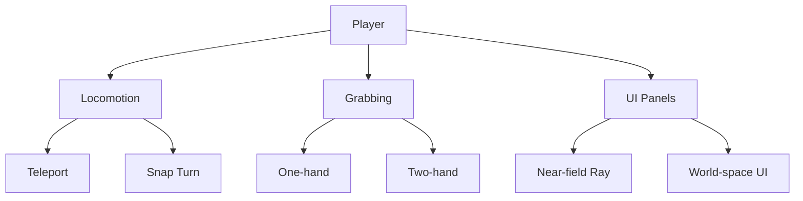

# Interaction Pattern Library (Quest 3)

## Purpose
- Capture VR interaction patterns observed during store research to inform tutorial prompts and UX in the miner training sim.

## Patterns
- Locomotion: teleport default; snap turn 45°; continuous move optional with vignette.
- Grabbing: XRI direct/indirect interactor; two-hand support for tools.
- UI: world-space panels; near-field ray; large targets; haptic confirm.
- Feedback: haptics + audio for state change; visual affordances on hover.
- Safety: guardian hints; height calibration; pause anytime.

## Diagram

## Links
- [[../70_Project_Documentation/XR_to_DOTS_Bridge_Plan|XR → DOTS Bridge Plan]]
- [[../90_Roadmap_Updates/90_Day_VR_Miner_Roadmap|90-Day Roadmap]]

