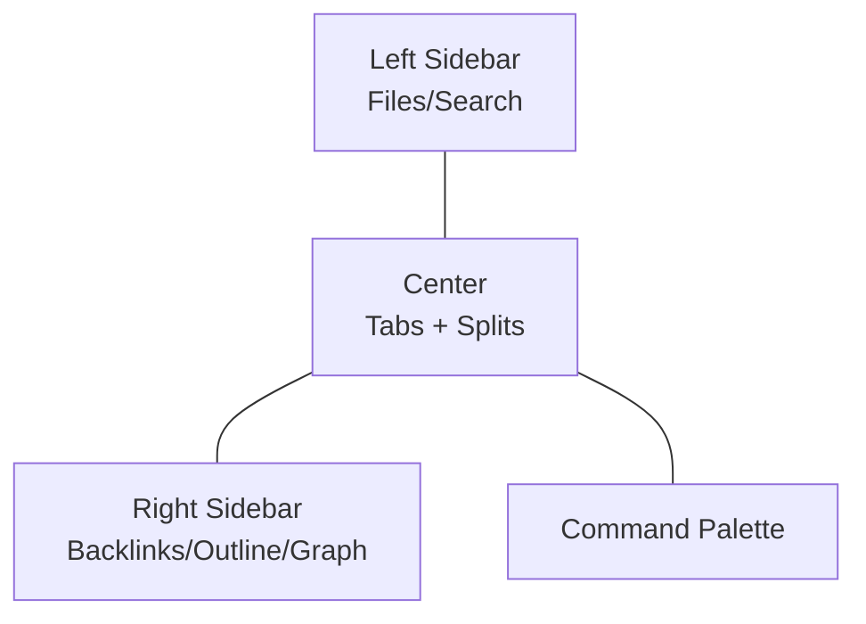

# Obsidian UI/UX Guidelines (for Web Emulation)

> Canonical rules to mirror the Obsidian app’s look-and-feel in our MkDocs site.
> Cross‑link: [[../00_Home/INDEX|Home Index]] · [[../Project_Directory_Index|Project Directory Index]] · [[./Gravity_Graph_Design_Guidelines|Graph Guidelines]]

## Core Philosophy
- Simplicity, high information density, and low visual noise
- Keyboard-first workflows with discoverable commands (palette)
- Panes and sidebars are optional, collapsible, and resizable
- Graph, backlinks, and properties are contextual and non-blocking

## Primary Layout
- Left sidebar: vault explorer, search, starred, tags
- Center: note tabs with splits, markdown preview style
- Right sidebar: context panes (backlinks, outline, graph)
- Global top bar: minimalist; search, quick actions, settings

## Panels & Behavior
- Sidebars toggle via hotkeys and remember last state
- Resizers show on hover; width persists per session
- Right sidebar never overlaps content; content keeps ≥ 60% viewport
- Mobile: sidebars become overlays; swipe to reveal; hidden by default

## Tabs, Splits, Navigation
- Tabs show file name, dirty state, close icon
- Split horizontally/vertically; drag tab to split area
- Middle-click tab to close; Ctrl/Cmd+Tab cycles
- Breadcrumbs: folder › note; optional in narrow views

## Typography & Spacing
- Font: system UI stack or Inter; monospace for code
- Sizes: 16px base; H1 28–32, H2 24–26, H3 20–22
- Line length target: 70–90ch; line height 1.5–1.65
- Spacing: 24px section, 12–16px paragraph, compact lists

## Color & Theming
- Dark default; neutral blue‑gray surfaces; accent purple/indigo
- State colors: info #66ccff, success #34d399, warn #fbbf24, danger #f87171
- Links underline on hover; visited state subtle
- Focus rings visible (outline 2px, 3:1 contrast)

## Markdown Rendering Rules
- Headings have anchor hover icons; copy‑link shortcut
- Code blocks: copy button, language badges
- Callouts map to admonitions (tip, warning, info, example)
- Task lists show native checkboxes; strikethrough on complete

## Graph & Context Panes
- Node hierarchy: current > neighbors > others (see [[./Gravity_Graph_Design_Guidelines|Graph Guidelines]])
- Pane is resizable and collapsible; remembers size; auto‑respects content min width
- Clicking a node opens the note in current tab; Shift+Click opens new tab

## Command Palette & Hotkeys
- Palette opens with Ctrl/Cmd+P; fuzzy search with recent actions first
- Common shortcuts: Ctrl/Cmd+N new note, Ctrl/Cmd+S save, Ctrl/Cmd+K link, Ctrl/Cmd+F search, Alt+Arrow navigate tabs, Ctrl/Cmd+/ toggle right sidebar, Ctrl/Cmd+B toggle left sidebar

## Accessibility
- Tab order includes sidebars, content, toolbar, and graph nodes
- All interactive elements have aria‑labels; tooltips on hover/focus
- Minimum target size 44×44px; high‑contrast theme available

## Persistence & Preferences
- Remember: open tabs, split layout, sidebar visibility, sidebar widths, last visited note
- Provide quick reset to defaults

## Web Implementation Notes (MkDocs)
- Left sidebar: use nav tree; show collapse/expand; sticky height
- Center: enforce max content width and readable typography
- Right sidebar: our `#vrmines-graph-pane` with `--vr-graph-w` clamp; never overlap
- Add a Palette modal (future): fuzzy search across pages and headings

## Validation Checklist
- Layout responds at 1600, 1280, 1024, 768, 428 widths
- Content ≥ 60% viewport when sidebars visible
- Sidebars toggle with hotkeys and buttons
- Keyboard navigation reaches every control and node
- Graph pane resize does not cause reflow jank

## Links
- Obsidian app inspiration; implement pragmatically within MkDocs
- Related: [[../70_Project_Documentation/VR_Coal_Mining_Simulator/INDEX|Simulator Docs Index]] · [[../90_Roadmap_Updates/90_Day_VR_Miner_Roadmap|90‑Day Roadmap]]

---
Backlinks: [[../Project_Directory_Index|Project Directory Index]] · [[./Gravity_Graph_Design_Guidelines|Graph Guidelines]]
