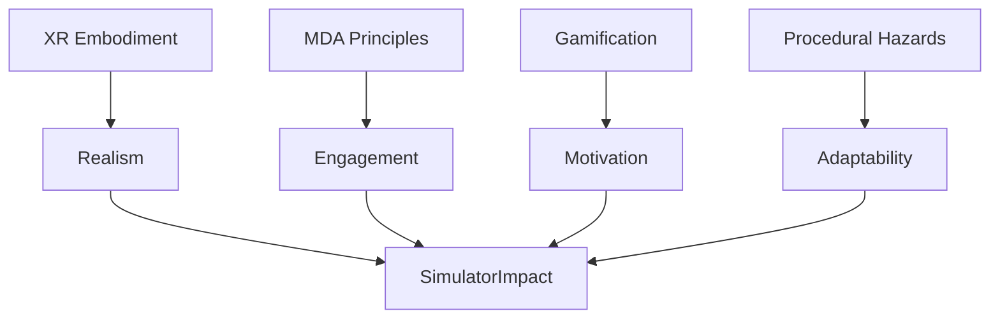

### Week 3 Research Synthesis — XR, Game Design, Gamification, Procedural Hazards

> [!tip] Purpose
> Connect this week’s reading and notes to concrete simulator outcomes.

- **XR basics → Safety training realism**
  - Embodiment via controllers: grabbing tools, crouching, torch usage.
  - Quest 3 portability for onsite training.
  - ✅ Impact: Presence in a hazardous mine without real risk.

- **Game design principles (MDA)**
  - **Mechanics**: PPE checks, tools, hazards (rockfall, gas, fire).
  - **Dynamics**: Timed responses, resource tradeoffs, route decisions.
  - **Aesthetics**: Tension → relief; mastery → confidence.

- **Gamification**
  - Progression: Tutorial → Tasks → Boss hazard.
  - Feedback: Points for correct safety actions; penalties for violations.
  - Rewards: Badges (Safe Worker, Quick Responder); optional leaderboard.

- **Procedural hazards (why/how)**
  - Reflects unpredictability of real incidents.
  - Techniques: seeded random spawns, weighted event graphs, DOTS systems.
  - Outcome: Unique runs force critical thinking, not rote.

### Implementation Hooks
- Link to features: [[../70_Project_Documentation/VR_Coal_Mining_Simulator/Features/Drill_System_DOTS|Drill System (DOTS)]], [[../70_Project_Documentation/VR_Coal_Mining_Simulator/Mechanics_Spec|Mechanics Spec]].
- DOTS integration: hazard spawn systems, jobified scoring, burst-powered checks.

### Links
- Back to indices: [[../00_Home/INDEX|Home Index]] • [[./INDEX|Research Index]] • [[../Project_Directory_Index|Project Directory Index]].

---
Backlinks: [[../70_Project_Documentation/VR_Coal_Mining_Simulator/INDEX|Simulator Index]], [[../70_Project_Documentation/Design_Brief_Game_Design_Gamification|Design Brief]].

