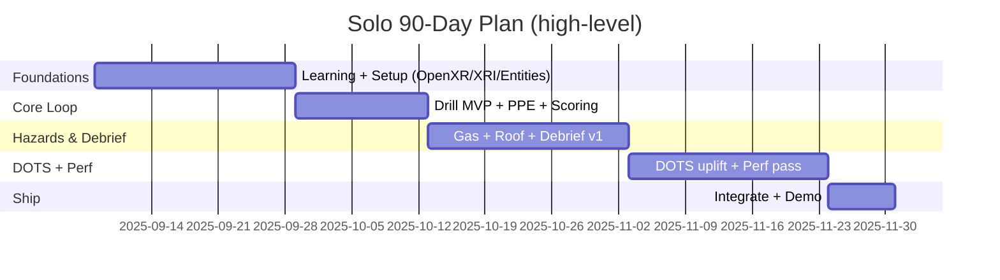
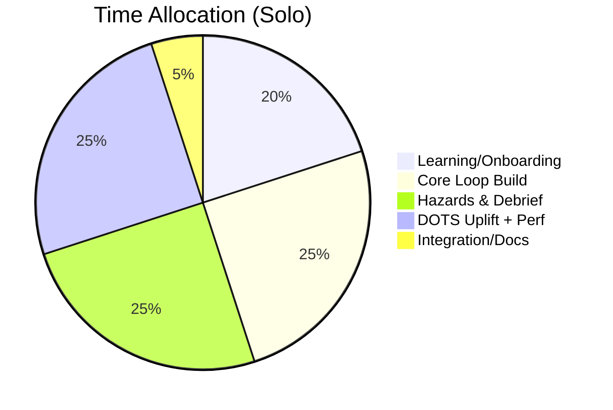

# 90-Day Build Plan + Post-90 Polish (Solo-dev realistic)

## Phase A — Build (Days 1–90)
- Day 1–21: Foundations + Learning Buffer (URP, OpenXR, XRI, Entities intro, SubScenes)
- Day 22–42: Core Loop v1 (Drill mono MVP), PPE check, basic scoring
- Day 43–63: Hazards v1 (gas zone + roof warning), debrief v1
- Day 64–84: DOTS uplift for hot paths (spawners, scoring), perf pass 1
- Day 85–90: Integration, stabilization, demo packaging

## Phase B — Polish (Post Day 90)
- Perf pass 2 (GPU/CPU), memory trimming, hitches removal
- Audio polish: mixing, sidechain ducking, localized VO QC
- Visual polish: lighting, materials, VFX optimization
- UX polish: menu flow, debrief visuals, accessibility refinements
- Content: instructor guide finalization, scenario authoring templates
- Validation: extended playtests, SSQ/NASA‑TLX analysis

## Deliverables
- Day 90: Quest 3 build (AAB), demo video, documentation set (core loop + 2 hazards)
- Post‑90: Polished build candidate; trainer materials

## Links
- [[../70_Project_Documentation/GDD/VR_Mines_GDD|GDD]] • [[./90_Day_Roadmap_Update_Week1|Week 1]] • [[../70_Project_Documentation/DOTS_Migration_Plan|DOTS Plan]]

## Infographics

