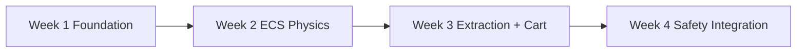

# 90-Day Roadmap Update - Week 1

## Current Status: Foundation & Audit Phase
**Date**: 2025-09-16  
**Week**: 1 of 12 (Day 2)  
**Phase**: Month 1 - Foundation & Audit  

---

## Weekly Progress Summary

### ✅ Completed This Week
- **Unity XR Toolkit Setup**: Successfully configured XR Interaction Toolkit
- **Quest 3 Development Environment**: Established stable development pipeline
- **DOTS Plan**: Defined ECS migration targets and subscene workflow
- **Project Documentation**: Created comprehensive feature documentation system
- **Public Devlog Setup**: Prepared YouTube content strategy and first script

### 🎯 Focus Areas This Week
- **Immersive Experience Design**: Presence-first criteria
- **ECS Drill Foundation**: Start converting drill interaction to Entities
- **Performance Optimization**: Ensuring 72+ FPS on Quest 3
- **User Experience Research**: Mining safety training requirements

---

## Week-by-Week Breakdown

### Week 1: Foundation & Immersive Design
| **Focus** | **Tasks** | **Deliverable** | **Immersion Overlap** |
|-----------|-----------|-----------------|----------------------|
| **XR Setup** | Unity XR Toolkit configuration, Quest 3 setup | Working XR environment | Establishing presence through proper setup |
| **DOTS Plan** | Identify ECS targets, set up Entities packages | Migration plan | Performance budget for immersion |
| **Drill Foundation** | ECS authoring for drill | Drill interaction prototype | Realistic tool feedback |
| **Documentation** | Feature and research docs | Comprehensive docs | Validation framework |

### Week 2: Core Interaction Systems
| **Focus** | **Tasks** | **Deliverable** | **Immersion Overlap** |
|-----------|-----------|-----------------|----------------------|
| **Physics (ECS)** | Entities Physics, weight, impacts | Physics-based drill | Authentic tool handling |
| **Haptic Feedback** | Controller vibration patterns | Tactile feedback system | Enhanced presence |
| **Audio System** | Spatial audio implementation | 3D positioned sound | Environmental immersion |
| **UI/UX Design** | VR-appropriate interface design | Intuitive VR interface | Comfortable UX |

### Week 3: Mining Mechanics
| **Focus** | **Tasks** | **Deliverable** | **Immersion Overlap** |
|-----------|-----------|-----------------|----------------------|
| **Coal Extraction** | ECS-based extraction mechanics | Extraction system | Realistic mining |
| **Cart System** | ECS transport mechanics | Cart interaction system | Workflow training |
| **Environmental Design** | Mine tunnel atmosphere | Immersive environment | Spatial presence |
| **Performance Testing** | Quest 3 optimization | Optimized performance | Comfort |

### Week 4: Safety Integration
| **Focus** | **Tasks** | **Deliverable** | **Immersion Overlap** |
|-----------|-----------|-----------------|----------------------|
| **Safety Gear** | Helmet and equipment enforcement | Safety gear system | Protocol training |
| **Hazard Simulation** | Gas leak and collapse cues | Hazard response training | Stress immersion |
| **Emergency Procedures** | Evacuation protocol training | Emergency response system | Muscle memory |
| **Status Report** | Month 1 progress documentation | Comprehensive status report | Validation |

---

## Next Week's Priorities

1. **Advance ECS Drill System**: Haptics and physics events
2. **Implement Spatial Audio**: 3D positioned sound effects
3. **Begin Coal Extraction Mechanics (ECS)**
4. **Prepare Week 2 Devlog**: DOTS migration learnings
5. **User Testing Setup**: Initial feedback collection

---

*This roadmap will be updated weekly to reflect actual progress and any necessary adjustments to the development timeline.*
