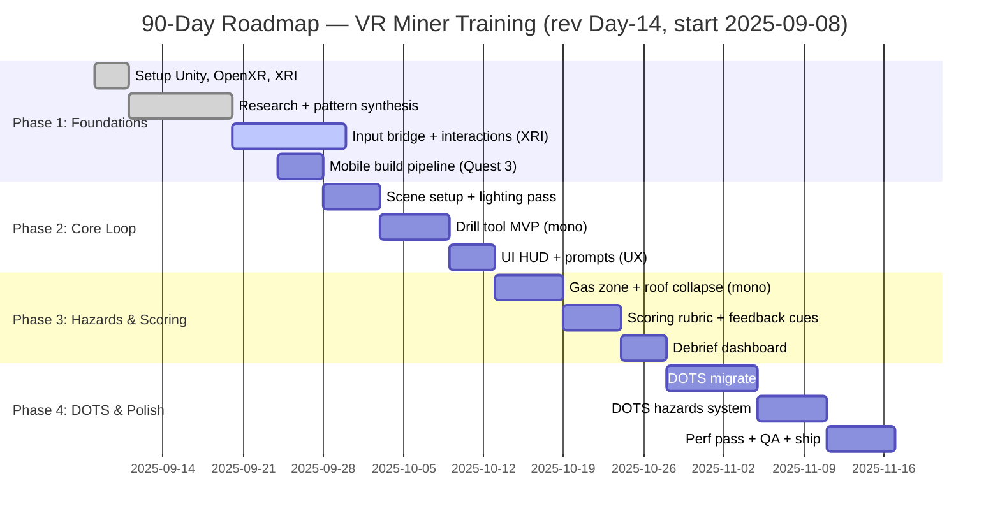

# 90-Day Roadmap — VR Miner Training (Quest 3)

> Solo dev with Unity experience, learning VR and DOTS by building. Uses existing assets. Target: playable training sim on Quest 3 with core loop, hazards, scoring, and debrief.

## Goals
- Shipping goal: Tutorial + 2 training drills; hazards, PPE check, scoring, debrief dashboard.
- Technical goal: Learn XR Interaction Toolkit (XRI), OpenXR, and Unity Entities (DOTS) fundamentals; migrate high-impact systems to DOTS.
- Performance goal: 72–90 FPS on Quest 3; frame timing stable under 13.8 ms.

## Scope
- Platforms: Quest 3 (standalone). Editor: Unity 2023 LTS.
- Input: Hand controllers first; hand-tracking optional in post-90.
- Assets: Reuse existing 3D models and textures; avoid heavy shaders.
- Out-of-scope (90 days): Networking, multiplayer, advanced AI, pickaxe interaction.

## High-Level Phases (Start: 2025-09-08)
1. Foundation & VR onboarding (Days 1–21)
2. Core loop & environment (Days 22–42)
3. Hazards, scoring, debrief (Days 43–63)
4. DOTS migration, polish, and ship (Days 64–90)

## Day-14 Progress Update (Research-driven revision)
- Setup complete: Unity 2023 LTS, OpenXR, XRI rig, URP mobile profile, Quest 3 build pipeline.
- 2025-09-08 → 2025-09-19 research: store survey, teardown of reference titles, and interaction audit aligned to miner training.
- Decisions locked:
  - Locomotion defaults: teleport + snap turn; continuous move optional with vignette.
  - Interaction: XRI grab; world-space UI with near-field ray; two-hand support where needed.
  - Training outcomes first: safety compliance and hazard recognition over sandbox realism.
  - Performance budgets: 100–120 draw calls; 1.5–2.0M tris; baked lighting; ASTC 6x6.
- Evidence from notes incorporated:
  - Competitive analysis checklist (comfort, onboarding, prompts, feedback loops).
  - Content rhythm for devlogs/livestreams to document learning by building.
  - Feature list refined: hazards (gas zone, roof collapse), scoring rubric, debrief.
- New artifacts tracked in docs/: Interaction Pattern Library, Comfort & Safety Guidelines, Debrief rubric.

## Gantt (shifted to real start date)

## Weekly Breakdown

### Weeks 1–3: Foundations (Sep 8–28)
- Install Unity 2023 LTS + Android/Quest toolchain; set up OpenXR + XRI rig.
- Locomotion: teleport + snap turn + continuous move; comfort vignettes.
- Grabbing/using tools; build `XRInput_Bridge` wrapper to centralize inputs.
- First Quest 3 build; verify framerate and render scale; enable Vulkan.
- Research deliverable: Interaction patterns + Comfort guidelines (DONE).

Deliverables:
- "VR Playground" scene with interactables; APK running on Quest 3.
- Pattern library and comfort guidelines feeding tutorial design (NEW).

### Weeks 4–6: Core Loop (Sep 29–Oct 19)
- Create mine scene using existing assets; budget triangles and textures.
- Implement Drill MVP using monobehaviour first; haptics + audio loop.
- UX prompts, tooltips, and basic tutorial guide; pause menu.

Deliverables:
- Playable loop: pick up drill → drill ore → deposit sample.

### Weeks 7–9: Hazards & Scoring (Oct 20–Nov 9)
- Implement Gas Zone and Roof Collapse hazards (mono prototype).
- Scoring rubric: time, safety compliance, error penalties; feedback cues.
- Debrief dashboard with session summary and guidance.

Deliverables:
- Two hazards active; end-of-run score with insights.

### Weeks 10–12: DOTS & Polish (Nov 10–Nov 30)
- Migrate high-impact systems to DOTS: drill updates, hazard spawner, scoring events.
- Convert spawners and hazard checks to Entities with Systems; keep XRI mono.
- Performance pass: URP mobile profile, GPU instancing, occlusion culling, LODs.

Deliverables:
- Stable 72–90 FPS; DOTS systems for spawning and scoring events.

## Learning Plan (by building)
- VR Essentials: XRI interactables, locomotion, haptics, UI in world space.
- Mobile VR Performance: URP settings, baked lighting, texture compression, frame timing.
- DOTS Basics: Entities, Components, Systems; authoring components; baking workflow.
- Data-Driven Hazards: event channels, rule-driven penalties, ECS queries.

## Milestones & Demos (dated)
- Sep 28 (Day 21): Playground demo APK + research synthesis.
- Oct 19 (Day 42): Core loop demo APK (drill MVP + scene + tutorial).
- Nov 9 (Day 63): Hazards + scoring demo APK.
- Nov 30 (Day 84): DOTS feature-complete; perf pass starts.
- Dec 7 (Day 90): DOTS-polished training build with debrief.

## Risks & Mitigations
- VR sickness: offer teleport + snap turn; vignette strength options.
- Performance dips: profiling cadence; reduce draw calls; mesh atlases; LOD.
- DOTS learning curve: migrate only perf-critical paths; keep XRI in mono.
- Solo bandwidth: cut features aggressively; reuse assets; scope weekly.

## Links
- [[../70_Project_Documentation/XR_to_DOTS_Bridge_Plan|XR → DOTS Bridge Plan]]
- [[../70_Project_Documentation/DOTS_Migration_Plan|DOTS Migration Plan]]
- [[../70_Project_Documentation/VR_Coal_Mining_Simulator/Backlog|Backlog]]

## Backlinks
- [[../Project_Directory_Index|Project Directory Index]]

