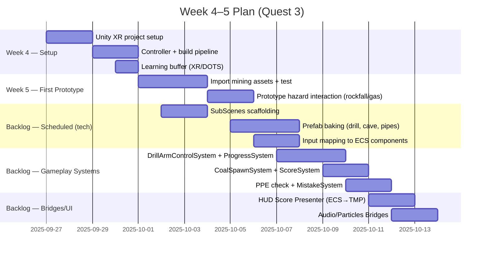
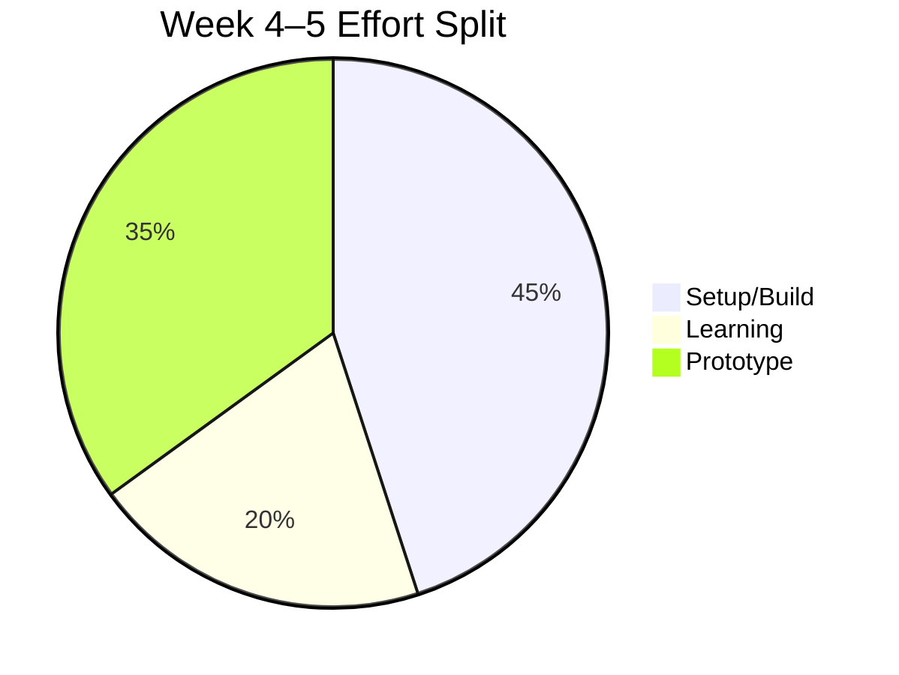

### Weekly Status Update — Week 3

**Work completed**
- Structured research on XR embodiment, MDA design, gamification, procedural hazards.
- Organized notes in vault and linked to simulator specs.
- Defined feature: [[../70_Project_Documentation/VR_Coal_Mining_Simulator/Features/Procedural_Hazards_Gamification|Procedural Hazards + Gamification]].

**Framing for advisor**
- Focused on foundational research and documentation to accelerate October implementation.
- Set up clear, measurable targets for the next two weeks.

### Next Two Weeks Plan (solo realistic)

**Deliverables**
- Unity project initialized; Quest 3 build verified.
- One test scene with imported assets.
- Simple hazard prototype (rockfall or gas leak) with scoring hook.

**Blockers**
- None major; headset reconfiguration may be needed.

### At-a-glance

### Links
- [[../80_Research_Notes/Week_03_Research_Synthesis|Week 3 Research Synthesis]] • [[../Project_Directory_Index|Project Directory Index]]

