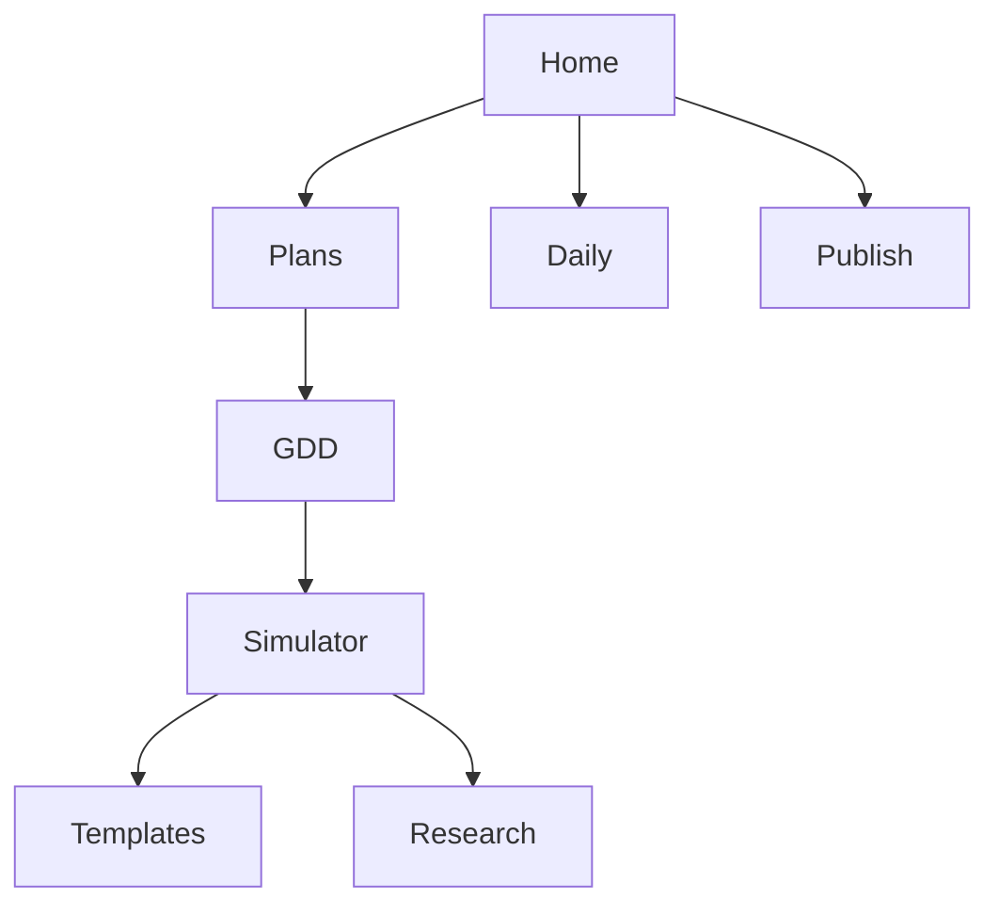

# Project Directory Index (Authoritative Links)

> This index points to canonical documents; avoid duplicating content. Update links, not copies.

## Home
- [[./00_Home/INDEX|Home Index]] • [[./00_Home/Project_Dashboard|Dashboard]] • [[./00_Home/Graph_Overview|Graph Overview]] • [[./00_Home/MOC_VR_Mines|MOC]]

## Plans & Roadmaps
- [[./90_Roadmap_Updates/90_Day_Master_Plan|90-Day Build + Post-90 Polish]]
- [[./90_Roadmap_Updates/90_Day_VR_Miner_Roadmap|90-Day Roadmap — VR Miner Training (Quest 3)]]
- [[./70_Project_Documentation/DOTS_Migration_Plan|DOTS Migration Plan]]
- [[./70_Project_Documentation/XR_to_DOTS_Bridge_Plan|Unity XR → DOTS Bridge Plan]]

## GDD & Design
- [[./70_Project_Documentation/GDD/VR_Mines_GDD|GDD — SafeOps]]
- [[./70_Project_Documentation/Design_Brief_Game_Design_Gamification|Design Brief: Game Design & Gamification]]
- [[./70_Project_Documentation/User_Flow_Storyline|User Flow + Storyline]]

## Simulator Docs
- [[./70_Project_Documentation/VR_Coal_Mining_Simulator/INDEX|Simulator Index]]
  - [[./70_Project_Documentation/VR_Coal_Mining_Simulator/Backlog|Backlog]] • [[./70_Project_Documentation/VR_Coal_Mining_Simulator/Backlog.kanban|Kanban]]
  - [[./70_Project_Documentation/VR_Coal_Mining_Simulator/Features/Drill_System_DOTS|Drill System (DOTS)]]
  - [[./70_Project_Documentation/VR_Coal_Mining_Simulator/Systems_Analysis|Systems Analysis]]
  - [[./70_Project_Documentation/VR_Coal_Mining_Simulator/External_Overview_Utilization|External Overview Utilization]]
  - [[./70_Project_Documentation/VR_Coal_Mining_Simulator/Overview_Condensed|Overview (Condensed)]]
  - [[./70_Project_Documentation/VR_Coal_Mining_Simulator/DOTS_Migration_Runbook|DOTS Migration Runbook]]
  - Meetings: [[./70_Project_Documentation/VR_Coal_Mining_Simulator/Meetings/2025-09-11_Minutes|2025-09-11]]

## Code Templates
- [[./70_Project_Documentation/Code_Templates/INDEX|Templates Index]]

## Research
- [[./80_Research_Notes/INDEX|Research Index]]
  - [[./80_Research_Notes/Game_Design_Fundamentals_Bible|Game Design Fundamentals — Bible]]
  - [[./80_Research_Notes/Interaction_Pattern_Library|Interaction Pattern Library]]
  - [[./80_Research_Notes/Comfort_and_Safety_Guidelines|Comfort & Safety Guidelines]]
  - [[./80_Research_Notes/Debrief_Rubric|Debrief Rubric]]

## Daily/Weekly
- [[./40_Daily/README|Daily Logs]] • [[./40_Daily/Weekly|Weekly Notes]] • [[./40_Daily/Progress_Tracker|Progress Tracker]]

## Publish (Public Notes)
- [[./Publish/README|Publish Index]]

## Visual Sitemap

